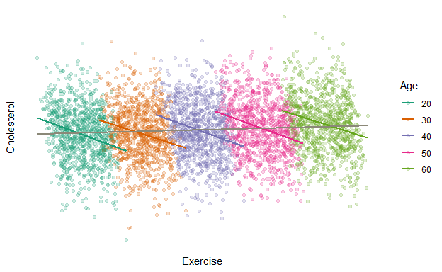
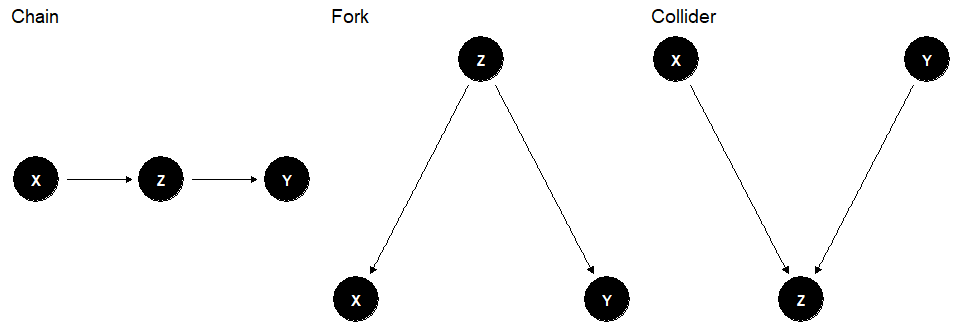
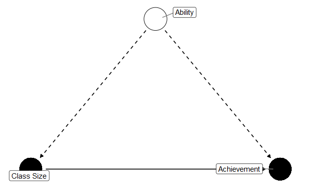
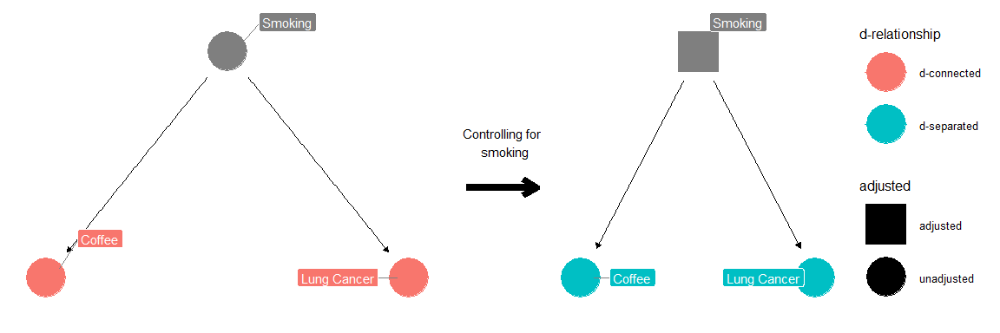
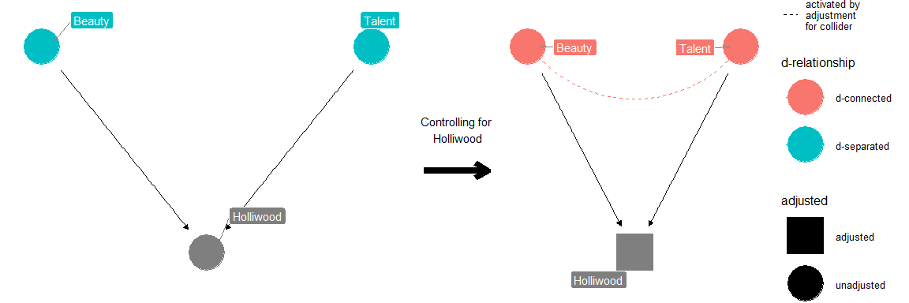
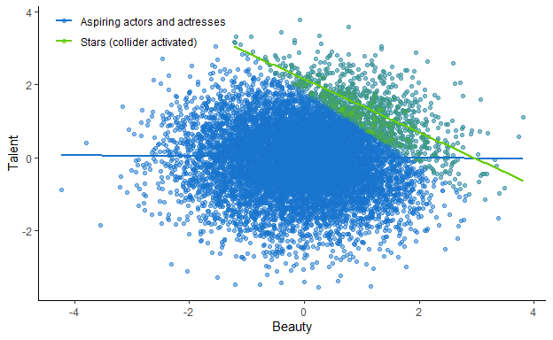

1\. DAGs and the Structural Causal Model
================
João Pedro S. Macalós
9/22/2020

# 1\. Preliminaries

## 1.1 General info

  - Welcome everyone\!

  - We will have an introductory round later

  - Please mute your microphone unless you are speaking

  - Please activate your video (if possible)

  - You are not allowed to record the session

  - From students to students

  - All the material will be indicated via the YSI events

  - Disclaimer: This webinars series does not provide any credits

  - Format of the discussions:
    
      - Theory + application
      - Focus on young scholars’ inputs
      - (Open for suggestions)

## 1.2 Motivation of this series

  - The book of why

  - The almost complete absence of DAGs in ’metrics literature

## 1.3 Young Scholars Initiative

  - The Young Scholars Initiative (YSI) is an international community
    comprised of students, young professionals, and researchers.

  - The community is organized through a number of working groups set up
    along topical lines. In these groups, we create stimulating
    environments for new economic thought and inquiry in a wide range of
    subject matters

  - Why States and Markets WG?
    
      - Pluralism in economics: research, teaching, and **methods**

## 1.4 Schedule

  - \~ once every week

  - Breaks \~every 3 week

<table class="table" style="margin-left: auto; margin-right: auto;">

<thead>

<tr>

<th style="text-align:left;">

N

</th>

<th style="text-align:left;">

Session

</th>

<th style="text-align:left;">

Reading

</th>

<th style="text-align:left;">

Date

</th>

<th style="text-align:left;">

Time

</th>

</tr>

</thead>

<tbody>

<tr>

<td style="text-align:left;font-weight: bold;color: white !important;background-color: red !important;">

1

</td>

<td style="text-align:left;font-weight: bold;color: white !important;background-color: red !important;">

DAGs and the Structural Causal Model

</td>

<td style="text-align:left;font-weight: bold;color: white !important;background-color: red !important;">

Ch. 4

</td>

<td style="text-align:left;font-weight: bold;color: white !important;background-color: red !important;">

09/22/2020

</td>

<td style="text-align:left;font-weight: bold;color: white !important;background-color: red !important;">

19h CET

</td>

</tr>

<tr>

<td style="text-align:left;">

2

</td>

<td style="text-align:left;">

Potential Outcomes: Introduction

</td>

<td style="text-align:left;">

Ch. 5

</td>

<td style="text-align:left;">

09/29/2020

</td>

<td style="text-align:left;">

19h CET

</td>

</tr>

<tr>

<td style="text-align:left;">

3

</td>

<td style="text-align:left;">

Matching and subclassification

</td>

<td style="text-align:left;">

Ch. 6

</td>

<td style="text-align:left;">

10/06/2020

</td>

<td style="text-align:left;">

19h CET

</td>

</tr>

<tr>

<td style="text-align:left;">

–

</td>

<td style="text-align:left;">

BREAK

</td>

<td style="text-align:left;">

–

</td>

<td style="text-align:left;">

10/13/2020

</td>

<td style="text-align:left;">

19h CET

</td>

</tr>

<tr>

<td style="text-align:left;">

4

</td>

<td style="text-align:left;">

Instrumental variables

</td>

<td style="text-align:left;">

Ch. 8

</td>

<td style="text-align:left;">

10/20/2020

</td>

<td style="text-align:left;">

19h CET

</td>

</tr>

<tr>

<td style="text-align:left;">

5

</td>

<td style="text-align:left;">

Dagifying IVs

</td>

<td style="text-align:left;">

TBD

</td>

<td style="text-align:left;">

10/27/2020

</td>

<td style="text-align:left;">

19h CET

</td>

</tr>

<tr>

<td style="text-align:left;">

6

</td>

<td style="text-align:left;">

Regression Discontinuity Designs

</td>

<td style="text-align:left;">

Ch. 7

</td>

<td style="text-align:left;">

11/03/2020

</td>

<td style="text-align:left;">

19h CET

</td>

</tr>

<tr>

<td style="text-align:left;">

–

</td>

<td style="text-align:left;">

BREAK - YSI Plenary

</td>

<td style="text-align:left;">

–

</td>

<td style="text-align:left;">

11/10/2020

</td>

<td style="text-align:left;">

19h CET

</td>

</tr>

<tr>

<td style="text-align:left;">

–

</td>

<td style="text-align:left;">

BREAK - YSI Plenary

</td>

<td style="text-align:left;">

–

</td>

<td style="text-align:left;">

11/17/2020

</td>

<td style="text-align:left;">

19h CET

</td>

</tr>

<tr>

<td style="text-align:left;">

7

</td>

<td style="text-align:left;">

Difference-in-differences

</td>

<td style="text-align:left;">

Ch. 9

</td>

<td style="text-align:left;">

11/24/2020

</td>

<td style="text-align:left;">

19h CET

</td>

</tr>

<tr>

<td style="text-align:left;">

8

</td>

<td style="text-align:left;">

Dagifying DiD

</td>

<td style="text-align:left;">

TBD

</td>

<td style="text-align:left;">

12/01/2020

</td>

<td style="text-align:left;">

19h CET

</td>

</tr>

<tr>

<td style="text-align:left;">

9

</td>

<td style="text-align:left;">

Front-door criterion: a new research design?

</td>

<td style="text-align:left;">

TBD

</td>

<td style="text-align:left;">

12/08/2020

</td>

<td style="text-align:left;">

19h CET

</td>

</tr>

<tr>

<td style="text-align:left;">

10

</td>

<td style="text-align:left;">

Conclusion

</td>

<td style="text-align:left;">

–

</td>

<td style="text-align:left;">

12/15/2020

</td>

<td style="text-align:left;">

19h CET

</td>

</tr>

</tbody>

</table>

# 2\. Directed Acyclic Graphs (DAGs) and the Structural Causal Model

Main References: Pearl, Glymour, and Jewell (2016) and Cunningham
(2020).

  - Simpson’s paradox: A relationship that holds for the population as a
    whole is reversed when we stratify the data into subgroups.

Example: Relationship between *exercise*, *age*, and *cholesterol*:

<!-- -->

We can see in the same in this table:

<table class="table" style="margin-left: auto; margin-right: auto;">

<thead>

<tr>

<th style="text-align:left;">

</th>

<th style="text-align:left;">

Low exercise

</th>

<th style="text-align:left;">

High exercise

</th>

</tr>

</thead>

<tbody>

<tr>

<td style="text-align:left;">

Low age

</td>

<td style="text-align:left;">

1326 out of 2453 with low cholesterol (54%)

</td>

<td style="text-align:left;">

42 out of 47 with low cholesterol (89%)

</td>

</tr>

<tr>

<td style="text-align:left;">

High age

</td>

<td style="text-align:left;">

4 out of 47 with low cholesterol (9%)

</td>

<td style="text-align:left;">

1128 out of 2453 with low cholesterol (46%)

</td>

</tr>

<tr>

<td style="text-align:left;">

Total

</td>

<td style="text-align:left;">

1330 out of 2500 with low cholesterol (53%)

</td>

<td style="text-align:left;">

1170 out of 2500 with low cholesterol (47%)

</td>

</tr>

</tbody>

</table>

Should we stratify the data?

Solution to the Simpson’s paradox: causal theory

DAGs are a way to formalize theoretical background, and to formalize
(automatize) how and when it is possible to identify causal effects with
the data at hand.

## Basic graphic structures

A graph is composed of *nodes* and *edges*. In a directed graph, arrows
indicate the flow of causation.

Only Directed *acyclic* graphs (DAGs) are covered in Pearl’s causal
theory – no cycles (self-causation) are allowed.

<!-- -->

## D-separation

“*d-separation* (the *d* stands for”directional") allows us to
determine, for any pair of nodes, whether the nodes are *d*-connected,
meaning that there exists a connecting path between them, or
*d*-separated, meaning that there exists no such path.

When we say that a pair of nodes are *d*-separated, we mean that the
variables they represent are definitely independent."

> Definition (d-separation): A path
>  is blocked by a set
> of nodes  if and only
> if

> 1.   contains a chain
>     of nodes  or a fork  such that the middle node
>      is in
>      (i.e.,
>      is conditioned
>     on), or

> 2.   contains a
>     collider  such that the collision node
>      is not in
>     , and no
>     descendant of  is
>     in 

> (Pearl et al., ‘Primer’, p. 46)

## Non-causal paths and the Backdoor criterion

  - Causal association flows from
     to
     along *directed*
    paths

  - Any other flows between these two nodes are *non-causal*

  - *non-causal* links can arise:

  - if a node, say ,
    goes into  and into
    .
    
      - This are known as **backdoor** paths because they have an edge
        that goes in the “backdoor” of the treatment/exposure variable.

  - if a collider node in between the two nodes is conditioned.

> Definition (Backdoor criterion): Given an ordered pair of variables
> ") in a DAG, a set of variables
>  satisfies the
> backdoor criterion relative to ") if:

> 1.   blocks all paths
>     between  and
>      that contain an
>     arrow into 
>     (backdoor paths)

> 2.   does not contain
>     any descendents of 

> (Pearl et al., ‘Primer’, p. 61)

In words, if a given set of variables
 meet the backdoor
criterion, the causal effect between
 and
 can be identified.

## Examples:

### 2.1 Chains (mediation)

<!-- -->

While in the population, coffee is associated with agitation, if we
control for the ingestion of caffeine, we see that the association
disappears (e.g., decaf coffee does not lead to agitation).

### 2.2 Forks (Confounding)

<!-- -->

### 2.3 Collider bias

<!-- -->

## Numerical example

``` r
# Population
N = 10000

# X and Y are random variables
beauty <- rnorm(N)
talent <- rnorm(N)

# M is caused by X and Y
holliwood <- beauty + talent
holliwood <- holliwood > quantile(holliwood, 0.90)
```

<!-- -->

## Final remarks

  - DAGs strongest assumption: absence of arrows.

  - Credibility revolution
     emphasis on **research designs** to identify causal
    effects

  - Can DAGs be used to clarify the hypotheses underlying these
    different designs?

## References

<div id="refs" class="references hanging-indent">

<div id="ref-cunningham2020causal">

Cunningham, Scott. 2020. *Causal Inference: The Mixtape (V. 1.8)*.
Manuscript.

</div>

<div id="ref-pearl2016causal">

Pearl, J., M. Glymour, and N. P. Jewell. 2016. *Causal Inference in
Statistics: A Primer*. Wiley.

</div>

</div>
