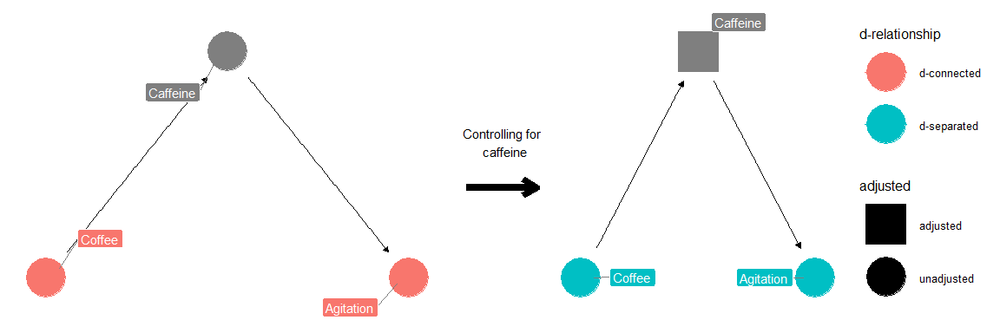
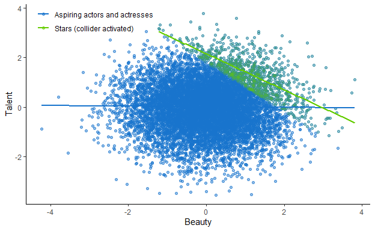

Potential Outcomes
================
João Pedro S. Macalós
9/29/2020

## Today

<table class="table" style="margin-left: auto; margin-right: auto;">

<thead>

<tr>

<th style="text-align:left;">

N

</th>

<th style="text-align:left;">

Session

</th>

<th style="text-align:left;">

Reading

</th>

<th style="text-align:left;">

Date

</th>

<th style="text-align:left;">

Time

</th>

</tr>

</thead>

<tbody>

<tr>

<td style="text-align:left;">

1

</td>

<td style="text-align:left;">

DAGs and the Structural Causal Model

</td>

<td style="text-align:left;">

Ch. 4

</td>

<td style="text-align:left;">

09/22/2020

</td>

<td style="text-align:left;">

19h CET

</td>

</tr>

<tr>

<td style="text-align:left;font-weight: bold;color: white !important;background-color: red !important;">

2

</td>

<td style="text-align:left;font-weight: bold;color: white !important;background-color: red !important;">

Potential Outcomes: Introduction

</td>

<td style="text-align:left;font-weight: bold;color: white !important;background-color: red !important;">

Ch. 5

</td>

<td style="text-align:left;font-weight: bold;color: white !important;background-color: red !important;">

09/29/2020

</td>

<td style="text-align:left;font-weight: bold;color: white !important;background-color: red !important;">

19h CET

</td>

</tr>

<tr>

<td style="text-align:left;">

3

</td>

<td style="text-align:left;">

Matching and subclassification

</td>

<td style="text-align:left;">

Ch. 6

</td>

<td style="text-align:left;">

10/06/2020

</td>

<td style="text-align:left;">

19h CET

</td>

</tr>

<tr>

<td style="text-align:left;">

–

</td>

<td style="text-align:left;">

BREAK

</td>

<td style="text-align:left;">

–

</td>

<td style="text-align:left;">

10/13/2020

</td>

<td style="text-align:left;">

19h CET

</td>

</tr>

<tr>

<td style="text-align:left;">

4

</td>

<td style="text-align:left;">

Instrumental variables

</td>

<td style="text-align:left;">

Ch. 8

</td>

<td style="text-align:left;">

10/20/2020

</td>

<td style="text-align:left;">

19h CET

</td>

</tr>

<tr>

<td style="text-align:left;">

5

</td>

<td style="text-align:left;">

Dagifying IVs

</td>

<td style="text-align:left;">

TBD

</td>

<td style="text-align:left;">

10/27/2020

</td>

<td style="text-align:left;">

19h CET

</td>

</tr>

<tr>

<td style="text-align:left;">

6

</td>

<td style="text-align:left;">

Regression Discontinuity Designs

</td>

<td style="text-align:left;">

Ch. 7

</td>

<td style="text-align:left;">

11/03/2020

</td>

<td style="text-align:left;">

19h CET

</td>

</tr>

<tr>

<td style="text-align:left;">

–

</td>

<td style="text-align:left;">

BREAK - YSI Plenary

</td>

<td style="text-align:left;">

–

</td>

<td style="text-align:left;">

11/10/2020

</td>

<td style="text-align:left;">

19h CET

</td>

</tr>

<tr>

<td style="text-align:left;">

–

</td>

<td style="text-align:left;">

BREAK - YSI Plenary

</td>

<td style="text-align:left;">

–

</td>

<td style="text-align:left;">

11/17/2020

</td>

<td style="text-align:left;">

19h CET

</td>

</tr>

<tr>

<td style="text-align:left;">

7

</td>

<td style="text-align:left;">

Difference-in-differences

</td>

<td style="text-align:left;">

Ch. 9

</td>

<td style="text-align:left;">

11/24/2020

</td>

<td style="text-align:left;">

19h CET

</td>

</tr>

<tr>

<td style="text-align:left;">

8

</td>

<td style="text-align:left;">

Dagifying DiD

</td>

<td style="text-align:left;">

TBD

</td>

<td style="text-align:left;">

12/01/2020

</td>

<td style="text-align:left;">

19h CET

</td>

</tr>

<tr>

<td style="text-align:left;">

9

</td>

<td style="text-align:left;">

Front-door criterion: a new research design?

</td>

<td style="text-align:left;">

TBD

</td>

<td style="text-align:left;">

12/08/2020

</td>

<td style="text-align:left;">

19h CET

</td>

</tr>

<tr>

<td style="text-align:left;">

10

</td>

<td style="text-align:left;">

Conclusion

</td>

<td style="text-align:left;">

–

</td>

<td style="text-align:left;">

12/15/2020

</td>

<td style="text-align:left;">

19h CET

</td>

</tr>

</tbody>

</table>

# Potential Outcomes

Main reference:

  - Cunningham (2020), ch. 5

Extra:

  - Angrist and Pischke (2009) “Mostly Harmless Econometrics”, ch. 2

  - Morgan and Winship (2014) “Counterfactuals and causal inference”,
    ch. 2

## Potential Outcomes - Introduction

A causal effect is defined as a comparison between two states of the
world – **what-if** questions.

In other words, **Counterfactual** questions.

**Potential outcomes** are these states of the world. In the binary
case, the potential outcomes are:

1.  What would be the **outcome** had D == 1 been observed? (treatment
    state)

2.  What would be the **outcome** had D == 0 been observed? (control
    state)

Notationally:

  
  
  
  

Fundamental problem of Causal Inference:

It is impossible to *observe* the value of
 and
 on the
same unit and, therefore, it is impossible to *observe* the effect of D
== 1 on .

  - Holland 1986 “Statistics and Causal Inference”.

### Observable outcomes

Observale outcomes,  are distinct from potential outcomes. They are *factual* random
variables.

A unit’s observable outcome is determined according to the *switching
equation*:

  
 Y^0_i
\\qquad(1)
\\end{equation}")  

### Treatment effect

The treatment effect (or causal effect) is defined as:

  
  

### Average Treatment Effects (ATE)

Is the average treatment effect in the population

  
![\\begin{equation\*}&#10;\\color{black}&#10;ATE = E\[\\delta\_i\] =
E\[Y^1\_i - Y^0\_i\] = E\[Y^1\_i\] -
E\[Y^0\_i\]&#10;\\end{equation\*}](https://latex.codecogs.com/png.latex?%5Cbegin%7Bequation%2A%7D%0A%5Ccolor%7Bblack%7D%0AATE%20%3D%20E%5B%5Cdelta_i%5D%20%3D%20E%5BY%5E1_i%20-%20Y%5E0_i%5D%20%3D%20E%5BY%5E1_i%5D%20-%20E%5BY%5E0_i%5D%0A%5Cend%7Bequation%2A%7D
"\\begin{equation*}
\\color{black}
ATE = E[\\delta_i] = E[Y^1_i - Y^0_i] = E[Y^1_i] - E[Y^0_i]
\\end{equation*}")  

### Averate Treatment effect for the Treated (ATT)

The average treatment effect for only those who received the treatment

  
![\\begin{align\*}&#10;ATT &= E\[\\delta\_i|D\_i = 1\] \\\\&#10;&=
E\[Y^1\_i - Y^0\_i|D\_i = 1\] \\\\&#10;&= E\[Y^1\_i|D\_i=1\] -
E\[Y^0\_i|D\_i
= 1\]&#10;\\end{align\*}](https://latex.codecogs.com/png.latex?%5Cbegin%7Balign%2A%7D%0AATT%20%26%3D%20E%5B%5Cdelta_i%7CD_i%20%3D%201%5D%20%5C%5C%0A%26%3D%20E%5BY%5E1_i%20-%20Y%5E0_i%7CD_i%20%3D%201%5D%20%5C%5C%0A%26%3D%20E%5BY%5E1_i%7CD_i%3D1%5D%20-%20E%5BY%5E0_i%7CD_i%20%3D%201%5D%0A%5Cend%7Balign%2A%7D
"\\begin{align*}
ATT &= E[\\delta_i|D_i = 1] \\\\
&= E[Y^1_i - Y^0_i|D_i = 1] \\\\
&= E[Y^1_i|D_i=1] - E[Y^0_i|D_i = 1]
\\end{align*}")  

### Averate Treatment effect for the Untreated/control (ATU/ATC)

The average treatment effect for only those who did not receive the
treatment

  
![\\begin{align\*}&#10;ATU &= E\[\\delta\_i|D\_i = 0\] \\\\&#10;&=
E\[Y^1\_i - Y^0\_i|D\_i = 0\] \\\\&#10;&= E\[Y^1\_i|D\_i=0\] -
E\[Y^0\_i|D\_i
= 0\]&#10;\\end{align\*}](https://latex.codecogs.com/png.latex?%5Cbegin%7Balign%2A%7D%0AATU%20%26%3D%20E%5B%5Cdelta_i%7CD_i%20%3D%200%5D%20%5C%5C%0A%26%3D%20E%5BY%5E1_i%20-%20Y%5E0_i%7CD_i%20%3D%200%5D%20%5C%5C%0A%26%3D%20E%5BY%5E1_i%7CD_i%3D0%5D%20-%20E%5BY%5E0_i%7CD_i%20%3D%200%5D%0A%5Cend%7Balign%2A%7D
"\\begin{align*}
ATU &= E[\\delta_i|D_i = 0] \\\\
&= E[Y^1_i - Y^0_i|D_i = 0] \\\\
&= E[Y^1_i|D_i=0] - E[Y^0_i|D_i = 0]
\\end{align*}")  

These quantities cannot be observed. Causal inference try to estimate
these effects from data.

### Simple difference in means decomposition

Suppose that we could know the exact potential outcomes of ten patients
in a drug trial:

<table class="table" style="margin-left: auto; margin-right: auto;">

<thead>

<tr>

<th style="text-align:right;">

Patients

</th>

<th style="text-align:right;">


</th>

<th style="text-align:right;">


</th>

<th style="text-align:right;">


</th>

</tr>

</thead>

<tbody>

<tr>

<td style="text-align:right;">

1

</td>

<td style="text-align:right;">

7

</td>

<td style="text-align:right;">

1

</td>

<td style="text-align:right;">

6

</td>

</tr>

<tr>

<td style="text-align:right;">

2

</td>

<td style="text-align:right;">

5

</td>

<td style="text-align:right;">

6

</td>

<td style="text-align:right;">

\-1

</td>

</tr>

<tr>

<td style="text-align:right;">

3

</td>

<td style="text-align:right;">

5

</td>

<td style="text-align:right;">

1

</td>

<td style="text-align:right;">

4

</td>

</tr>

<tr>

<td style="text-align:right;">

4

</td>

<td style="text-align:right;">

7

</td>

<td style="text-align:right;">

8

</td>

<td style="text-align:right;">

\-1

</td>

</tr>

<tr>

<td style="text-align:right;">

5

</td>

<td style="text-align:right;">

4

</td>

<td style="text-align:right;">

2

</td>

<td style="text-align:right;">

2

</td>

</tr>

<tr>

<td style="text-align:right;">

6

</td>

<td style="text-align:right;">

10

</td>

<td style="text-align:right;">

1

</td>

<td style="text-align:right;">

9

</td>

</tr>

<tr>

<td style="text-align:right;">

7

</td>

<td style="text-align:right;">

1

</td>

<td style="text-align:right;">

10

</td>

<td style="text-align:right;">

\-9

</td>

</tr>

<tr>

<td style="text-align:right;">

8

</td>

<td style="text-align:right;">

5

</td>

<td style="text-align:right;">

6

</td>

<td style="text-align:right;">

\-1

</td>

</tr>

<tr>

<td style="text-align:right;">

9

</td>

<td style="text-align:right;">

3

</td>

<td style="text-align:right;">

7

</td>

<td style="text-align:right;">

\-4

</td>

</tr>

<tr>

<td style="text-align:right;">

10

</td>

<td style="text-align:right;">

9

</td>

<td style="text-align:right;">

8

</td>

<td style="text-align:right;">

1

</td>

</tr>

</tbody>

</table>

<table class="table" style="margin-left: auto; margin-right: auto;">

<thead>

<tr>

<th style="text-align:left;">

Average

</th>

<th style="text-align:right;">


</th>

<th style="text-align:right;">


</th>

<th style="text-align:right;">


</th>

</tr>

</thead>

<tbody>

<tr>

<td style="text-align:left;">

ATE

</td>

<td style="text-align:right;">

5.6

</td>

<td style="text-align:right;">

5

</td>

<td style="text-align:right;">

0.6

</td>

</tr>

</tbody>

</table>

However, in reality, we would can only observe one outcome for each
unit. A real data set could look like the following table:

    ## # A tibble: 10 x 3
    ##    Patients     Y     D
    ##       <int> <dbl> <dbl>
    ##  1        1     7     1
    ##  2        2     6     0
    ##  3        3     5     1
    ##  4        4     8     0
    ##  5        5     4     1
    ##  6        6    10     1
    ##  7        7    10     0
    ##  8        8     6     0
    ##  9        9     7     0
    ## 10       10     9     1

One could try to *naively* estimate the ATE from these data using the
*simple difference in means (SDO)*:

  
![\\begin{equation}&#10;\\color{black}&#10;SDO = E\[Y^1|D=1\] -
E\[Y^0|D=0\]&#10;\\qquad(2)&#10;\\end{equation}](https://latex.codecogs.com/png.latex?%5Cbegin%7Bequation%7D%0A%5Ccolor%7Bblack%7D%0ASDO%20%3D%20E%5BY%5E1%7CD%3D1%5D%20-%20E%5BY%5E0%7CD%3D0%5D%0A%5Cqquad%282%29%0A%5Cend%7Bequation%7D
"\\begin{equation}
\\color{black}
SDO = E[Y^1|D=1] - E[Y^0|D=0]
\\qquad(2)
\\end{equation}")  

In the example above, it would generate the following estimate:

    ## SDO =  -0.4

Which is far from the true
 ATE we saw
before.

In observation studies, this quantity will be most likely a biased
estimate of the ATE. It includes the ATE but its effect is confounded by
*selection bias* and *heterogeneous treatment effects* bias.

Formally (proof in Cunningham, p. 90):

  
![\\begin{align\*}&#10;\\sum (y\_i|d\_i = 1) - \\sum(y\_i|d\_i=0) &=
\\underbrace{E\[Y^1\] - E\[Y^0\]}\_\\text{ATE} \\\\&#10;&+
\\underbrace{E\[Y^0|D=1\] - E\[Y^0|D=0\]}\_\\text{Selection Bias}
\\\\&#10;& \\underbrace{(1-\\pi)(ATT - ATU)}\_\\text{Heterogeneous
Treatment
Effects}&#10;\\end{align\*}](https://latex.codecogs.com/png.latex?%5Cbegin%7Balign%2A%7D%0A%5Csum%20%28y_i%7Cd_i%20%3D%201%29%20-%20%5Csum%28y_i%7Cd_i%3D0%29%20%26%3D%20%5Cunderbrace%7BE%5BY%5E1%5D%20-%20E%5BY%5E0%5D%7D_%5Ctext%7BATE%7D%20%5C%5C%0A%26%2B%20%5Cunderbrace%7BE%5BY%5E0%7CD%3D1%5D%20-%20E%5BY%5E0%7CD%3D0%5D%7D_%5Ctext%7BSelection%20Bias%7D%20%5C%5C%0A%26%20%5Cunderbrace%7B%281-%5Cpi%29%28ATT%20-%20ATU%29%7D_%5Ctext%7BHeterogeneous%20Treatment%20Effects%7D%0A%5Cend%7Balign%2A%7D
"\\begin{align*}
\\sum (y_i|d_i = 1) - \\sum(y_i|d_i=0) &= \\underbrace{E[Y^1] - E[Y^0]}_\\text{ATE} \\\\
&+ \\underbrace{E[Y^0|D=1] - E[Y^0|D=0]}_\\text{Selection Bias} \\\\
& \\underbrace{(1-\\pi)(ATT - ATU)}_\\text{Heterogeneous Treatment Effects}
\\end{align*}")  

In the example, the bias is obvious. The main problem is that the
*potential outcomes are not independent (ex-ante) of the selection to
treatment*. In fact, if we go back and take a look at the table, we will
see that the treatment assignment was intentionally connected to the
potential outcomes.

## Randomization

  - Randomization is the most credible way of using the SDO to estimate
    ATE.

Why?

Because it enforces by design that, even if half of the potential
outcomes are not observed, the difference between the observed **means**
in the treatment and control group will converge to the difference of
the population averages (Pearl et. al, 2016, p. 105). Notationally:

  
 \\perp\\!\\!\\!\\perp D
\\end{equation*}")  

Which means that:

  
![\\begin{equation}&#10;\\color{black}&#10;E\[Y^1|D=1\] =
E\[Y^1|D=0\]&#10;\\qquad(3)&#10;\\end{equation}](https://latex.codecogs.com/png.latex?%5Cbegin%7Bequation%7D%0A%5Ccolor%7Bblack%7D%0AE%5BY%5E1%7CD%3D1%5D%20%3D%20E%5BY%5E1%7CD%3D0%5D%0A%5Cqquad%283%29%0A%5Cend%7Bequation%7D
"\\begin{equation}
\\color{black}
E[Y^1|D=1] = E[Y^1|D=0]
\\qquad(3)
\\end{equation}")  

  
![\\begin{equation}&#10;\\color{black}&#10;E\[Y^0|D=1\] =
E\[Y^0|D=0\]&#10;\\qquad(4)&#10;\\end{equation}](https://latex.codecogs.com/png.latex?%5Cbegin%7Bequation%7D%0A%5Ccolor%7Bblack%7D%0AE%5BY%5E0%7CD%3D1%5D%20%3D%20E%5BY%5E0%7CD%3D0%5D%0A%5Cqquad%284%29%0A%5Cend%7Bequation%7D
"\\begin{equation}
\\color{black}
E[Y^0|D=1] = E[Y^0|D=0]
\\qquad(4)
\\end{equation}")  

These equality makes the selection bias and the heterogeneous treatment
effects bias equal to zero:

  
![\\begin{align\*}&#10;SB &= E\[Y^0|D=1\] - E\[Y^0|D=0\] \\\\&#10;&=
E\[Y^0|D=1\] - E\[Y^0|D=1\]
\\\\&#10;&= 0&#10;\\end{align\*}](https://latex.codecogs.com/png.latex?%5Cbegin%7Balign%2A%7D%0ASB%20%26%3D%20E%5BY%5E0%7CD%3D1%5D%20-%20E%5BY%5E0%7CD%3D0%5D%20%5C%5C%0A%26%3D%20E%5BY%5E0%7CD%3D1%5D%20-%20E%5BY%5E0%7CD%3D1%5D%20%5C%5C%0A%26%3D%200%0A%5Cend%7Balign%2A%7D
"\\begin{align*}
SB &= E[Y^0|D=1] - E[Y^0|D=0] \\\\
&= E[Y^0|D=1] - E[Y^0|D=1] \\\\
&= 0
\\end{align*}")  

  
![\\begin{align\*}&#10;HTE &= (1-\\pi) \\cdot (ATT - ATU)
\\\\&#10;\\dots \\\\&#10;ATT - ATU &= E\[Y^1|D=1\] - E\[Y^0|D=1\] -
(E\[Y^1|D=0\] - E\[Y^0|D=0\]) \\\\&#10;&= E\[Y^1|D=1\] - E\[Y^0|D=1\] -
E\[Y^1|D=0\] + E\[Y^0|D=0\] \\\\&#10;&= E\[Y^1|D=1\] - E\[Y^1|D=1\] +
E\[Y^0|D=1\] - E\[Y^0|D=1\]
\\\\&#10;&= 0&#10;\\end{align\*}](https://latex.codecogs.com/png.latex?%5Cbegin%7Balign%2A%7D%0AHTE%20%26%3D%20%281-%5Cpi%29%20%5Ccdot%20%28ATT%20-%20ATU%29%20%5C%5C%0A%5Cdots%20%5C%5C%0AATT%20-%20ATU%20%26%3D%20E%5BY%5E1%7CD%3D1%5D%20-%20E%5BY%5E0%7CD%3D1%5D%20-%20%28E%5BY%5E1%7CD%3D0%5D%20-%20E%5BY%5E0%7CD%3D0%5D%29%20%5C%5C%0A%26%3D%20E%5BY%5E1%7CD%3D1%5D%20-%20E%5BY%5E0%7CD%3D1%5D%20-%20E%5BY%5E1%7CD%3D0%5D%20%2B%20E%5BY%5E0%7CD%3D0%5D%20%5C%5C%0A%26%3D%20E%5BY%5E1%7CD%3D1%5D%20-%20E%5BY%5E1%7CD%3D1%5D%20%2B%20E%5BY%5E0%7CD%3D1%5D%20-%20E%5BY%5E0%7CD%3D1%5D%20%5C%5C%0A%26%3D%200%0A%5Cend%7Balign%2A%7D
"\\begin{align*}
HTE &= (1-\\pi) \\cdot (ATT - ATU) \\\\
\\dots \\\\
ATT - ATU &= E[Y^1|D=1] - E[Y^0|D=1] - (E[Y^1|D=0] - E[Y^0|D=0]) \\\\
&= E[Y^1|D=1] - E[Y^0|D=1] - E[Y^1|D=0] + E[Y^0|D=0] \\\\
&= E[Y^1|D=1] - E[Y^1|D=1] + E[Y^0|D=1] - E[Y^0|D=1] \\\\
&= 0
\\end{align*}")  

Using the equalities generated by equations (3) and (4).

Hence, under randomization, the expected SDO converges to the ATE.

``` r
# Seeing is believing
set.seed(1234)
monte_carlo <- rerun(.n = 10000, {
  # Get random order of rows from data_patients
  rows <- sample(nrow(data_patients))
  # Shuffle the data
  DT <- data.table(data_patients[rows, ])
  # Assign the first five to treatment and the last five to control
  DT[, 'd'] <- c(rep(1, 5), rep(0, 5))
  # Get the observed outcomes with the switching equation
  DT <- DT[, y := d*y1 + (1-d)*y0][]
  # Get average value of Y by groups 'd'
  DT <- DT[, by = d, .(y = mean(y))]
  # Get SDOs
  data.table(sd0 = DT$y[2], sd1 = DT$y[1], sdo = DT$y[1] - DT$y[2])
})
# Bind all generated rows
monte_carlo1 <- rbindlist(monte_carlo)
# Get average value
avg_sdo <- pull(monte_carlo1[, .(sdo = mean(sdo))])
```

    ## Average SDO =  0.60106

## SUTVA (Stable Unit Treatment Value Assumption)

The potential outcomes model depends on a strong assumption: SUTVA

  - The potential outcomes of individuals must be unnafected by changes
    in treatment exposures of all other individuals

  - In other words, there is no macro (or externalities) effect.

## STAR example

Enough of theory, it is time to dagify\!

The Student/Teacher Achievement Ratio (STAR) study tried to measure the
average causal effect of class size on student achievement.

Before this study, many observation studies presented little to no
evidence of a significant effect of class size on student achievement.

However, some argued that weaker students are often deliberately placed
into smaller groups. Therefore, the effect of class size on achievement
could be confounded by the unobservable ability of students.

In a DAG:

<!-- -->

After randomization:

<!-- -->

That’s the idea.

But, in the STAR case, there was, in fact, a conditional randomization,
as class size was randomized inside schools but different schools had
non-random proportions of class sizes. Other control variables were also
used to increase precision. They were: gender, free lunch (proxy of
income), race, teacher experience, etc. The full DAG:

<!-- -->

There are many backdoor paths between `Class Size` and `Achievement`.
They are:

  
  


is a minimal sufficient set to block all backdoor paths in this DAG.
Unfortunately, `Ability` is unobserved.

The modified DAG after randomiziation look like:

<!-- -->

<!-- -->
