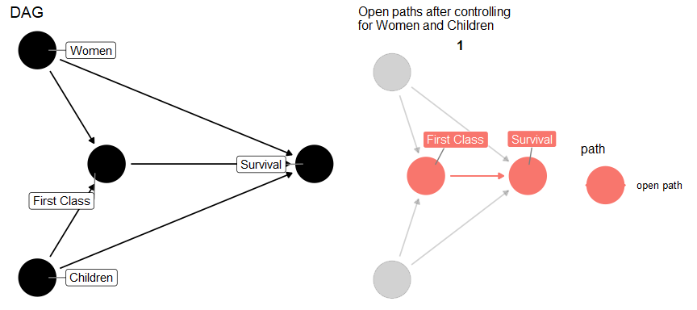
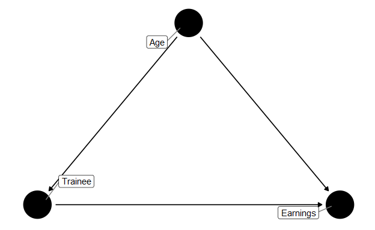
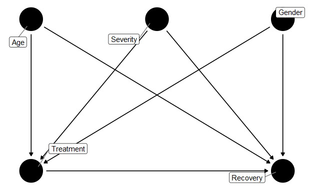
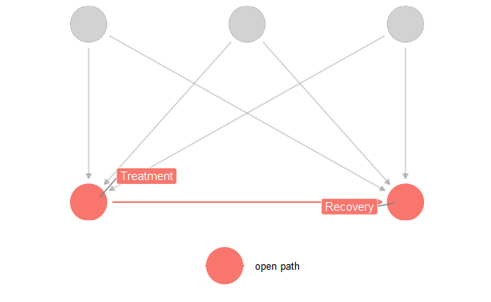
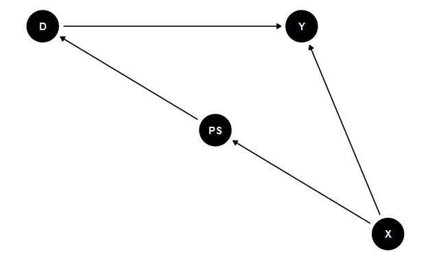
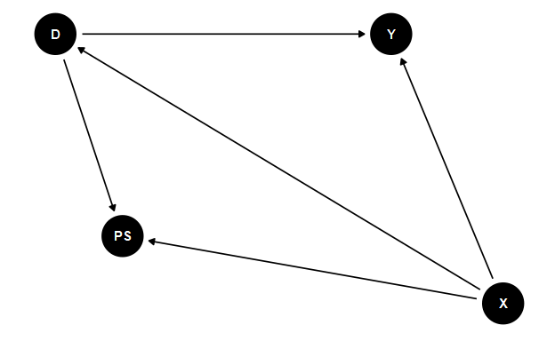
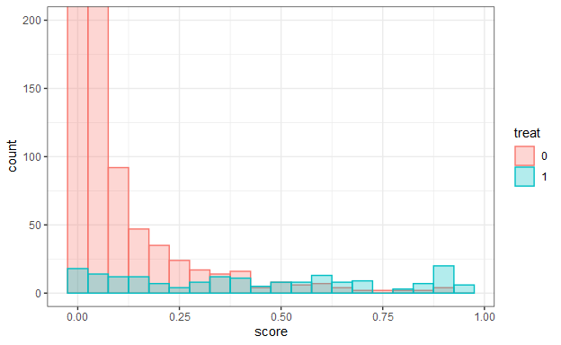

3\. Subclassification and matching
================
João Pedro S. Macalós
10/5/2020

Schedule:

<table class="table" style="margin-left: auto; margin-right: auto;">

<thead>

<tr>

<th style="text-align:left;">

N

</th>

<th style="text-align:left;">

Session

</th>

<th style="text-align:left;">

Reading

</th>

<th style="text-align:left;">

Date

</th>

</tr>

</thead>

<tbody>

<tr>

<td style="text-align:left;">

1

</td>

<td style="text-align:left;">

DAGs and the Structural Causal Model

</td>

<td style="text-align:left;">

Ch. 4

</td>

<td style="text-align:left;">

09/22/2020

</td>

</tr>

<tr>

<td style="text-align:left;">

2

</td>

<td style="text-align:left;">

Potential Outcomes: Introduction

</td>

<td style="text-align:left;">

Ch. 5

</td>

<td style="text-align:left;">

09/29/2020

</td>

</tr>

<tr>

<td style="text-align:left;font-weight: bold;color: white !important;background-color: red !important;">

3

</td>

<td style="text-align:left;font-weight: bold;color: white !important;background-color: red !important;">

Matching and subclassification

</td>

<td style="text-align:left;font-weight: bold;color: white !important;background-color: red !important;">

Ch. 6

</td>

<td style="text-align:left;font-weight: bold;color: white !important;background-color: red !important;">

10/06/2020

</td>

</tr>

<tr>

<td style="text-align:left;">

–

</td>

<td style="text-align:left;">

BREAK

</td>

<td style="text-align:left;">

–

</td>

<td style="text-align:left;">

10/13/2020

</td>

</tr>

<tr>

<td style="text-align:left;">

4

</td>

<td style="text-align:left;">

Instrumental variables

</td>

<td style="text-align:left;">

Ch. 8

</td>

<td style="text-align:left;">

10/20/2020

</td>

</tr>

<tr>

<td style="text-align:left;font-size: 11px;">

</td>

<td style="text-align:left;font-size: 11px;">

<https://ysi.ineteconomics.org/project/5f4258a9689c756fb5ddb637/event/5f797f72a21037043d13e072>

</td>

<td style="text-align:left;font-size: 11px;">

</td>

<td style="text-align:left;font-size: 11px;">

</td>

</tr>

<tr>

<td style="text-align:left;">

5

</td>

<td style="text-align:left;">

Dagifying IVs

</td>

<td style="text-align:left;">

TBD

</td>

<td style="text-align:left;">

10/27/2020

</td>

</tr>

<tr>

<td style="text-align:left;">

6

</td>

<td style="text-align:left;">

Regression Discontinuity Designs

</td>

<td style="text-align:left;">

Ch. 7

</td>

<td style="text-align:left;">

11/03/2020

</td>

</tr>

<tr>

<td style="text-align:left;">

–

</td>

<td style="text-align:left;">

BREAK - YSI Plenary

</td>

<td style="text-align:left;">

–

</td>

<td style="text-align:left;">

11/10/2020

</td>

</tr>

<tr>

<td style="text-align:left;">

–

</td>

<td style="text-align:left;">

BREAK - YSI Plenary

</td>

<td style="text-align:left;">

–

</td>

<td style="text-align:left;">

11/17/2020

</td>

</tr>

<tr>

<td style="text-align:left;">

7

</td>

<td style="text-align:left;">

Difference-in-differences

</td>

<td style="text-align:left;">

Ch. 9

</td>

<td style="text-align:left;">

11/24/2020

</td>

</tr>

<tr>

<td style="text-align:left;">

8

</td>

<td style="text-align:left;">

Dagifying DiD

</td>

<td style="text-align:left;">

TBD

</td>

<td style="text-align:left;">

12/01/2020

</td>

</tr>

<tr>

<td style="text-align:left;">

9

</td>

<td style="text-align:left;">

Front-door criterion: a new research design?

</td>

<td style="text-align:left;">

TBD

</td>

<td style="text-align:left;">

12/08/2020

</td>

</tr>

<tr>

<td style="text-align:left;">

10

</td>

<td style="text-align:left;">

Conclusion

</td>

<td style="text-align:left;">

–

</td>

<td style="text-align:left;">

12/15/2020

</td>

</tr>

</tbody>

</table>

# Subclassification, Matching, and Propensity Scores

References:

  - Cunningham 2020, ch. 6

  - Angrist and Pischke, p. 69-91

  - Morgan and Winship. ch. 5

  - Matheus Facure github page:
    <https://github.com/matheusfacure/python-causality-handbook>

## Subclassification

Subclassification, as all methods studied in this chapter, is a method
designed to control for observable confounders. In other words, the
objective of subclassification is to close open observed backdoor paths.

In subclassification, we compare the difference in outcomes between
treated and untreated in every subgroup of the covariates. The ATE is a
weighted average of these comparisons.

Mathematically (in the case of discrete covariates):

  
 \\cdot \\frac{N_k}{N}
\\end{equation*}")  

### Titanic example

Load the data using `mixtape` package:

``` r
titanic <- mixtape::titanic
```

Check the structure of the data:

``` r
glimpse(titanic)
```

    ## Rows: 2,201
    ## Columns: 4
    ## $ class    <labelled> 1, 1, 1, 1, 1, 1, 1, 1, 1, 1, 1, 1, 1, 1, 1, 1, 1, 1,...
    ## $ age      <labelled> 1, 1, 1, 1, 1, 1, 1, 1, 1, 1, 1, 1, 1, 1, 1, 1, 1, 1,...
    ## $ sex      <labelled> 1, 1, 1, 1, 1, 1, 1, 1, 1, 1, 1, 1, 1, 1, 1, 1, 1, 1,...
    ## $ survived <labelled> 1, 1, 1, 1, 1, 1, 1, 1, 1, 1, 1, 1, 1, 1, 1, 1, 1, 1,...

The question of interest here is: did first class passengers
disproportionately survived the Titanic accident?

We suspect that this hypothesis is true. However, we also noted that
**women** and **children**, who should have being prioritized to take a
place in the emergency boats, appear disproportionately among first
class passengers.

The Titanic DAG: <!-- --> Now let’s analyze
these data.

First: calculate NAIVE ATE:

    ## Naive ATE:  0.3538265

``` r
# 1. Calculate the ATE in each substrata

ate_in_strata <- titanic %>%
  # 1. Stratify the data into four groups
  group_by(age, sex, class) %>%
  summarize(survived = mean(survived)) %>%
  # 2. Calculate the difference in survival probabilities for each group
  group_by(age, sex) %>%
  summarize(survived = diff(survived))

ate_in_strata
```

    ## # A tibble: 4 x 3
    ## # Groups:   age [2]
    ##   age        sex        survived
    ##   <labelled> <labelled>    <dbl>
    ## 1 0          0             0.386
    ## 2 0          1             0.593
    ## 3 1          0             0.346
    ## 4 1          1             0.137

``` r
# 3. Calculate weights for each strata:
strata_weights <- titanic %>%
  group_by(age, sex, class) %>%
  summarize(n = n()) %>%
  filter(class == 0) %>%
  mutate(n = n/nrow(titanic)) %>%
  select(age, sex, weight = n)

# 4. Calculate the ATE:
ate_wt_titanic <- left_join(ate_in_strata, strata_weights) %>%
  ungroup %>%
  mutate(weighted_survived = survived * weight) %>%
  summarize(weighted_ate = sum(weighted_survived))

cat('Weighted ATE: ', ate_wt_titanic$weighted_ate)
```

    ## Weighted ATE:  0.1609087

## Matching

The idea of matching is to find a group of observations among the
untreated in which the relevant covariates (the ones that block all
backdoor paths) are exactly the same or similar to the covariates
observed in the treated group. These units are then used as
counterfactuals against the observed treated values.

### Exact matching

As the name says, in exact matching, the idea is to find observations in
the control group that exactly matches the covariates observed in the
treated group.

Mathematically:

  
![\\begin{equation\*}&#10;\\color{black}&#10;\\hat{\\delta\_{ATT}} =
\\frac{1}{N\_T} \\sum\_{D\_i=1} (Y\_i - \[\\frac{1}{M} \\sum\_{m=1}^M
Y\_{jm0}\])&#10;\\end{equation\*}](https://latex.codecogs.com/png.latex?%5Cbegin%7Bequation%2A%7D%0A%5Ccolor%7Bblack%7D%0A%5Chat%7B%5Cdelta_%7BATT%7D%7D%20%3D%20%5Cfrac%7B1%7D%7BN_T%7D%20%5Csum_%7BD_i%3D1%7D%20%28Y_i%20-%20%5B%5Cfrac%7B1%7D%7BM%7D%20%5Csum_%7Bm%3D1%7D%5EM%20Y_%7Bjm0%7D%5D%29%0A%5Cend%7Bequation%2A%7D
"\\begin{equation*}
\\color{black}
\\hat{\\delta_{ATT}} = \\frac{1}{N_T} \\sum_{D_i=1} (Y_i - [\\frac{1}{M} \\sum_{m=1}^M Y_{jm0}])
\\end{equation*}")  

This is best explained with an example:

<table class="table" style="font-size: 12px; width: auto !important; float: left; margin-right: 10px;">

<thead>

<tr>

<th style="text-align:right;">

unit

</th>

<th style="text-align:right;">

age

</th>

<th style="text-align:right;">

earnings

</th>

<th style="text-align:right;">

trainee

</th>

</tr>

</thead>

<tbody>

<tr>

<td style="text-align:right;">

1

</td>

<td style="text-align:right;">

18

</td>

<td style="text-align:right;">

9500

</td>

<td style="text-align:right;">

1

</td>

</tr>

<tr>

<td style="text-align:right;">

2

</td>

<td style="text-align:right;">

29

</td>

<td style="text-align:right;">

12250

</td>

<td style="text-align:right;">

1

</td>

</tr>

<tr>

<td style="text-align:right;">

3

</td>

<td style="text-align:right;">

24

</td>

<td style="text-align:right;">

11000

</td>

<td style="text-align:right;">

1

</td>

</tr>

<tr>

<td style="text-align:right;">

4

</td>

<td style="text-align:right;">

27

</td>

<td style="text-align:right;">

11750

</td>

<td style="text-align:right;">

1

</td>

</tr>

<tr>

<td style="text-align:right;">

5

</td>

<td style="text-align:right;">

33

</td>

<td style="text-align:right;">

13250

</td>

<td style="text-align:right;">

1

</td>

</tr>

<tr>

<td style="text-align:right;">

6

</td>

<td style="text-align:right;">

22

</td>

<td style="text-align:right;">

10500

</td>

<td style="text-align:right;">

1

</td>

</tr>

<tr>

<td style="text-align:right;">

7

</td>

<td style="text-align:right;">

19

</td>

<td style="text-align:right;">

9750

</td>

<td style="text-align:right;">

1

</td>

</tr>

<tr>

<td style="text-align:right;">

8

</td>

<td style="text-align:right;">

20

</td>

<td style="text-align:right;">

10000

</td>

<td style="text-align:right;">

1

</td>

</tr>

<tr>

<td style="text-align:right;">

9

</td>

<td style="text-align:right;">

21

</td>

<td style="text-align:right;">

10250

</td>

<td style="text-align:right;">

1

</td>

</tr>

<tr>

<td style="text-align:right;">

10

</td>

<td style="text-align:right;">

30

</td>

<td style="text-align:right;">

12500

</td>

<td style="text-align:right;">

1

</td>

</tr>

<tr>

<td style="text-align:right;">

11

</td>

<td style="text-align:right;">

20

</td>

<td style="text-align:right;">

8500

</td>

<td style="text-align:right;">

0

</td>

</tr>

<tr>

<td style="text-align:right;">

12

</td>

<td style="text-align:right;">

27

</td>

<td style="text-align:right;">

10075

</td>

<td style="text-align:right;">

0

</td>

</tr>

<tr>

<td style="text-align:right;">

13

</td>

<td style="text-align:right;">

21

</td>

<td style="text-align:right;">

8725

</td>

<td style="text-align:right;">

0

</td>

</tr>

<tr>

<td style="text-align:right;">

14

</td>

<td style="text-align:right;">

39

</td>

<td style="text-align:right;">

12775

</td>

<td style="text-align:right;">

0

</td>

</tr>

<tr>

<td style="text-align:right;">

15

</td>

<td style="text-align:right;">

38

</td>

<td style="text-align:right;">

12550

</td>

<td style="text-align:right;">

0

</td>

</tr>

</tbody>

</table>

<table class="table" style="font-size: 12px; width: auto !important; ">

<thead>

<tr>

<th style="text-align:right;">

unit

</th>

<th style="text-align:right;">

age

</th>

<th style="text-align:right;">

earnings

</th>

<th style="text-align:right;">

trainee

</th>

</tr>

</thead>

<tbody>

<tr>

<td style="text-align:right;">

16

</td>

<td style="text-align:right;">

29

</td>

<td style="text-align:right;">

10525

</td>

<td style="text-align:right;">

0

</td>

</tr>

<tr>

<td style="text-align:right;">

17

</td>

<td style="text-align:right;">

39

</td>

<td style="text-align:right;">

12775

</td>

<td style="text-align:right;">

0

</td>

</tr>

<tr>

<td style="text-align:right;">

18

</td>

<td style="text-align:right;">

33

</td>

<td style="text-align:right;">

11425

</td>

<td style="text-align:right;">

0

</td>

</tr>

<tr>

<td style="text-align:right;">

19

</td>

<td style="text-align:right;">

24

</td>

<td style="text-align:right;">

9400

</td>

<td style="text-align:right;">

0

</td>

</tr>

<tr>

<td style="text-align:right;">

20

</td>

<td style="text-align:right;">

30

</td>

<td style="text-align:right;">

10750

</td>

<td style="text-align:right;">

0

</td>

</tr>

<tr>

<td style="text-align:right;">

21

</td>

<td style="text-align:right;">

33

</td>

<td style="text-align:right;">

11425

</td>

<td style="text-align:right;">

0

</td>

</tr>

<tr>

<td style="text-align:right;">

22

</td>

<td style="text-align:right;">

36

</td>

<td style="text-align:right;">

12100

</td>

<td style="text-align:right;">

0

</td>

</tr>

<tr>

<td style="text-align:right;">

23

</td>

<td style="text-align:right;">

22

</td>

<td style="text-align:right;">

8950

</td>

<td style="text-align:right;">

0

</td>

</tr>

<tr>

<td style="text-align:right;">

24

</td>

<td style="text-align:right;">

18

</td>

<td style="text-align:right;">

8050

</td>

<td style="text-align:right;">

0

</td>

</tr>

<tr>

<td style="text-align:right;">

25

</td>

<td style="text-align:right;">

43

</td>

<td style="text-align:right;">

13675

</td>

<td style="text-align:right;">

0

</td>

</tr>

<tr>

<td style="text-align:right;">

26

</td>

<td style="text-align:right;">

39

</td>

<td style="text-align:right;">

12775

</td>

<td style="text-align:right;">

0

</td>

</tr>

<tr>

<td style="text-align:right;">

27

</td>

<td style="text-align:right;">

19

</td>

<td style="text-align:right;">

8275

</td>

<td style="text-align:right;">

0

</td>

</tr>

<tr>

<td style="text-align:right;">

28

</td>

<td style="text-align:right;">

30

</td>

<td style="text-align:right;">

9000

</td>

<td style="text-align:right;">

0

</td>

</tr>

<tr>

<td style="text-align:right;">

29

</td>

<td style="text-align:right;">

51

</td>

<td style="text-align:right;">

15475

</td>

<td style="text-align:right;">

0

</td>

</tr>

<tr>

<td style="text-align:right;">

30

</td>

<td style="text-align:right;">

48

</td>

<td style="text-align:right;">

14800

</td>

<td style="text-align:right;">

0

</td>

</tr>

</tbody>

</table>

In this example, we have a dataset on future earnings of participants
and non-participants of a trainee program, together with information on
their age. The hypothesis here is that **age** might be a confounder in
the relationship between **trainee** and **earnings**, for older people
tend to have higher earnings.

<!-- -->

In this example, what do you think is the quantity of interest? ATE,
ATT, or ATC?

If we are interested in calculating the ATE, we need to match values on
both sides (treatment and control), as no cell can be left empty. The
ATT is simpler to calculate, as we only need data that matches the
observed values on the treatment group.

We can summarize the data to check for balance on **age** and on
**earnings**:

    ## # A tibble: 2 x 3
    ##   trainee   age earnings
    ##     <dbl> <dbl>    <dbl>
    ## 1       0  32.0   11101.
    ## 2       1  24.3   11075

As we can see, the **trainee** group is significantly younger, and
receive less on average than the non-trainee group. The Naive ATE is:

    ## Naive ATE:  -26.25

The exact matching strategy consists of four steps:

1.  Save the age (the covariate) of the units in the treated group;

2.  Filter the untreated group to keep only those units which values
    exactly match those on the treated group. If more than one unit
    matches, we take the average value between these units to use as a
    counterfactual:

3.  Match the datasets;

4.  Calculate the ATT:

<!-- end list -->

``` r
# 1. Save age
age_trainee <- training %>%
  filter(trainee == 1) %>%
  pull(age)


# 2. Filter non-trainee group
matched_trainee <- training %>%
  filter(trainee == 0) %>%
  filter(age %in% age_trainee) %>%
  group_by(age) %>%
  summarize(matched_earnings = mean(earnings),
            funit = first(unit),
            lunit = last(unit)) %>%
  mutate(matched_unit = if_else(funit == lunit, as.character(funit), str_c(funit, ', ', lunit))) %>%
  select(-c(funit, lunit))

# 3. Match the datasets
matched_training <- training %>%
  filter(trainee == 1) %>%
  left_join(matched_trainee) %>%
  select(unit, matched_unit, earnings, matched_earnings)

kable(matched_training) %>%
  kable_styling(font_size = 12, full_width = F)
```

<table class="table" style="font-size: 12px; width: auto !important; margin-left: auto; margin-right: auto;">

<thead>

<tr>

<th style="text-align:right;">

unit

</th>

<th style="text-align:left;">

matched\_unit

</th>

<th style="text-align:right;">

earnings

</th>

<th style="text-align:right;">

matched\_earnings

</th>

</tr>

</thead>

<tbody>

<tr>

<td style="text-align:right;">

1

</td>

<td style="text-align:left;">

24

</td>

<td style="text-align:right;">

9500

</td>

<td style="text-align:right;">

8050

</td>

</tr>

<tr>

<td style="text-align:right;">

2

</td>

<td style="text-align:left;">

16

</td>

<td style="text-align:right;">

12250

</td>

<td style="text-align:right;">

10525

</td>

</tr>

<tr>

<td style="text-align:right;">

3

</td>

<td style="text-align:left;">

19

</td>

<td style="text-align:right;">

11000

</td>

<td style="text-align:right;">

9400

</td>

</tr>

<tr>

<td style="text-align:right;">

4

</td>

<td style="text-align:left;">

12

</td>

<td style="text-align:right;">

11750

</td>

<td style="text-align:right;">

10075

</td>

</tr>

<tr>

<td style="text-align:right;">

5

</td>

<td style="text-align:left;">

18, 21

</td>

<td style="text-align:right;">

13250

</td>

<td style="text-align:right;">

11425

</td>

</tr>

<tr>

<td style="text-align:right;">

6

</td>

<td style="text-align:left;">

23

</td>

<td style="text-align:right;">

10500

</td>

<td style="text-align:right;">

8950

</td>

</tr>

<tr>

<td style="text-align:right;">

7

</td>

<td style="text-align:left;">

27

</td>

<td style="text-align:right;">

9750

</td>

<td style="text-align:right;">

8275

</td>

</tr>

<tr>

<td style="text-align:right;">

8

</td>

<td style="text-align:left;">

11

</td>

<td style="text-align:right;">

10000

</td>

<td style="text-align:right;">

8500

</td>

</tr>

<tr>

<td style="text-align:right;">

9

</td>

<td style="text-align:left;">

13

</td>

<td style="text-align:right;">

10250

</td>

<td style="text-align:right;">

8725

</td>

</tr>

<tr>

<td style="text-align:right;">

10

</td>

<td style="text-align:left;">

20, 28

</td>

<td style="text-align:right;">

12500

</td>

<td style="text-align:right;">

9875

</td>

</tr>

</tbody>

</table>

``` r
# 4. Calculate the ATT
att_training <- mean(matched_training$earnings) - mean(matched_training$matched_earnings)
cat('ATT: ', att_training)
```

    ## ATT:  1695

### Approximate matching and bias-correcting

The problem with exact matching is that, in most of the cases, there
won’t be units on the control group that precisely match the units on
the treatment group apart from treatment status.

A common solution for matching, in these cases, is the utilization of
**approximate** matching. Approximate matching relies in some measure of
distance, as it will find the units in the control group that are closer
to the units in the treatment group.

There are many different measures of distance. Examples are: Euclidean
distance, normalized Euclidean distance, Mahalanobis Distance, Gower’s
distance. It is also common to use **propensity scores** as a measure of
distance.

Within approximate matching, it is commonly used the method of matching
on the **K-Near-Neighbors**, where the researcher define how many of the
closest neighbors should be matched. If more than one neighbor is
selected, then their values should be averaged out to form a
counterfactual to the treatment units.

However, the utilization of approximate matching will invariably lead to
bias. Further, this bias will be larger, the larger is the discrepancy
between the observed covariates in the treatment units and on the
selected matched control variables. Luckily, there are methods to
correct for this bias, as explained in Cunningham’s book.

#### Example of approximate matching and bias-correcting

I took this dataset from Matheus Facure page, as I think it is useful to
compare my results with his to check my code.

In this example, we want to check whether a hypothetical medicine
increases or decreases the days until recovery of a cohort of patients.
However, we suspect that elderly, male, and with more severe symptoms
patients are more likely to take the medicine and less likely to recover
faster from the disease.

These hypotheses are better presented in a DAG:

<!-- -->

In this example, we will use approximate matching to control for **Age**
and **Severity**:

<!-- -->

We first load the dataset:

``` r
medicine <- read_csv('Datasets/medication_matching.csv') %>%
  rename(male = sex)
```

And check the balance of the variables on each subgroup:

<table class="table" style="margin-left: auto; margin-right: auto;">

<thead>

<tr>

<th style="text-align:left;">

treatment

</th>

<th style="text-align:right;">

male

</th>

<th style="text-align:right;">

age

</th>

<th style="text-align:right;">

severity

</th>

</tr>

</thead>

<tbody>

<tr>

<td style="text-align:left;">

Whole dataset

</td>

<td style="text-align:right;">

0.4985000

</td>

<td style="text-align:right;">

31.91210

</td>

<td style="text-align:right;">

0.4698055

</td>

</tr>

<tr>

<td style="text-align:left;">

0

</td>

<td style="text-align:right;">

0.4544203

</td>

<td style="text-align:right;">

28.23480

</td>

<td style="text-align:right;">

0.3033067

</td>

</tr>

<tr>

<td style="text-align:left;">

1

</td>

<td style="text-align:right;">

0.5817447

</td>

<td style="text-align:right;">

38.85668

</td>

<td style="text-align:right;">

0.7842390

</td>

</tr>

</tbody>

</table>

The naive ATE in this example is:

``` r
naive_ate <- mean(medicine$recovery[medicine$treatment==1]) - mean(medicine$recovery[medicine$treatment==0]) 
cat('Naive ATE: ', naive_ate)
```

    ## Naive ATE:  16.8958

Is the treatment really harmful to the patients, increasing the days to
their recovery? Or is this estimator confounded?

In this example, we will try to figure it out by using subset of the
control units that most approximately matches the characteristics
observed in the treatment group as a counterfactual group.

To use approximate matching, however, it is important to take a distance
measure that is invariant to scale, or to rescale the variables prior to
finding the nearest matches. In this example, I will rescale the
variables according to the following formula:

  
} \\text{ where } \\widetilde{X} \\text{ is the rescaled variables}
\\end{equation*}")  

``` r
medicine <- medicine %>%
  mutate(across(c(male, age, severity), ~(.x - mean(.x)) / sd(.x)))
```

We then use these rescaled variables to find the nearest match for each
variable in our treatment group.

We will start with the `class` package. This package use the *Euclidean*
distance by default. We supply the X values (age, male, and seveirty) of
the untreated units as `train` data, the X values of the treated units
as `test` data. The Y (recovery) values of the untreated units is
supplied as `cl`, the classification or target value. This algorithm
will supply the Y values of the closest match for each unit in the
treatment group.

Remember: in this example, we are only looking for matches for the
treatment units. Hence, we are calculating the Average Treatment Effects
on the Treated (ATT). The matching estimator formula is the following:

  
})
\\end{equation*}")  

``` r
library(class)

treated <- filter(medicine, treatment == 1)
untreated <- filter(medicine, treatment == 0)

X <- c('age', 'male', 'severity')
y <- 'recovery' 

mt_y0 <- knn(train = as.matrix(untreated[, X]), 
                  test = as.matrix(treated[, X]),
                  cl = as.matrix(untreated[, y]), 
                  k=1)

# The output is a factor variable, so we should convert it to character and then to numeric to preserve the values
mt_y0 <- as.numeric(as.character(mt_y0))

matched_dt <- treated %>%
  mutate(match = mt_y0)

matched_att <- mean(matched_dt$recovery) - mean(matched_dt$match)
cat('Matched ATT: ', matched_att)
```

    ## Matched ATT:  -7.562536

``` r
# If we wanted to calculate the
```

If, however, we wanted to calculate the ATE, we would need to find
matches for both groups. The estimator formula is:

  
 \\cdot (Y_i - Y_{jm(i)})
\\end{equation*}")  

``` r
mt_y1 <- knn(
  train = as.matrix(treated[, X]), 
  test = as.matrix(untreated[, X]),
  cl = as.matrix(treated[, y]), 
  k=1
)

mt_y1 <- as.numeric(as.character(mt_y1))

matched_dtc <- untreated %>%
  mutate(match = mt_y1)

# Combine the two matched datasets
matched_dt_ate <- bind_rows(matched_dt, matched_dtc)

matched_ate <- mean((2 * matched_dt_ate$treatment - 1) * (matched_dt_ate$recovery - matched_dt_ate$match))
cat('Matched ATE: ', matched_ate)
```

    ## Matched ATE:  -0.9954

#### Bias correction

The problem with approximate matching is that its estimator will be
biased. The bigger the discrepancies, the higher will be the bias.
Fortunately, it is possible to correct for this bias. For a complete
description of the formulae and proofs, the reader should check pages
127-132 of Cunningham’s Mixtape (2020).

Here, I will just provide an intuition. This bias can be corrected by
adjusting the difference between the observed
 values and the
observed  values
by what would be the expected values of
 for these units without
any knowledge on the treatment. These expected values can be obtained by
regressing the values of  on the covariates .

Let’s check how to do it in R:

``` r
library(FNN)

# 1. Get the index of the nearest neighbors units to extract from untreated
index_knn <- get.knnx(untreated[, X],
                      treated[, X],
                      k=1)

# 2. Extract these units from untreated dataset
untreated_match <- untreated %>%
  slice(index_knn[[1]])

# 3. Regress y ~ X on the untreated units
reg_bcu <- lm(recovery ~ male + age + severity, data = untreated_match)

# 4. Augment the treated dataset with
treated_augmented <- treated %>% 
  mutate(
    # The matched data
    match = untreated_match$recovery,
    
    # The fitted treated values using the reg_bcu estimates to predict
    fitted = predict(reg_bcu, newdata = treated),
    
    # The fitted untreated values using the reg_bcu estimates to predict
    fitted_match = predict(reg_bcu)
    )

# 5. Calculate the according to the formula
bias_corrected_att <- treated_augmented %>%
  mutate(att = recovery - match - (fitted - fitted_match)) %>%
  summarize(att = mean(att)) %>%
  pull(att)

cat('Bias Corrected ATT: ', bias_corrected_att)
```

    ## Bias Corrected ATT:  -9.679314

To find the ATE:

``` r
index_knnu <- get.knnx(treated[, X],
                      untreated[, X],
                      k=1)

treated_match <- treated %>% slice(index_knnu[[1]])

reg_bct <- lm(recovery ~ male + age + severity, data = treated_match)

untreated_augmented <- untreated %>% 
  mutate(
    # The matched data
    match = treated_match$recovery,
    
    # The fitted treated values using the reg_bcu estimates to predict
    fitted = predict(reg_bct, newdata = untreated),
    
    # The fitted untreated values using the reg_bcu estimates to predict
    fitted_match = predict(reg_bct)
    )

bias_corrected_atc <- untreated_augmented %>%
  mutate(atc = match - recovery - (fitted_match - fitted)) %>%
  summarize(atc = mean(atc)) %>%
  pull(atc)

cat('Bias Corrected ATC: ', bias_corrected_atc)
```

    ## Bias Corrected ATC:  -6.664986

``` r
med_augmented <- bind_rows(treated_augmented, untreated_augmented)

bias_corrected_ate <- med_augmented %>%
  mutate(ate = (2*treatment - 1)*(recovery - match - (fitted - fitted_match))) %>%
  summarize(ate = mean(ate)) %>%
  pull(ate)

cat('Bias Corrected ATE: ', bias_corrected_ate)
```

    ## Bias Corrected ATE:  -7.708546

``` r
# A curious mind can also check that the bias corrected ATE is the weighted average of the ATT and ATC:
# bias_corrected_atc * (nrow(untreated)/nrow(medicine)) + bias_corrected_att * (nrow(treated)/nrow(medicine))
```

Hence we hard-coded the estimations of bias-corrected ATT, ATC, and ATE
for the medicine dataset. However, we still need some measure of the
standard errors. Calculating them is prone to errors and outside the
scope of this notebook.

The following piece of code uses the package `Matching`. This package
automates the whole analysis:

``` r
library(Matching)

att_med <- Match(
  Y=medicine$recovery, 
  Tr=medicine$treatment,
  X=medicine[,X],
  Z=medicine[,X],
  estimand='ATT',
  M=1,
  BiasAdjust = T
  )

summary(att_med)
```

    ## 
    ## Estimate...  -9.6796 
    ## AI SE......  0.12263 
    ## T-stat.....  -78.931 
    ## p.val......  < 2.22e-16 
    ## 
    ## Original number of observations..............  20000 
    ## Original number of treated obs...............  6924 
    ## Matched number of observations...............  6924 
    ## Matched number of observations  (unweighted).  6943

### Coarsened exact matching

The idea with coarsened exact matching is to discretize the covariates,
based on background knowledge and theoretical claims, in order to fill
the bins with units that can be used in exact matching.

# Propensity Score methods

The idea of propensity scores is to compare units who have similar
probabilities of being treated, given a set of covariates
.

According to Cunningham,

> If, conditional on X, two units have the same probability of being
> treated, then we say that they have similar *propensity scores*. If
> two units have the same propensity score, but one is in the treatment
> group and the other is not, and the *conditional independence
> assumption* (CIA) credibly holds in the data, then differences between
> their observed outcomes are attributable to the treatment. CIA in this
> context means that the assignment of treatment, conditional on the
> propensity score, is independent of potential outcomes, or ‘as good as
> random.’

There are two identifying assumptions for propensity score methods:

1.  Conditional independence assumption

2.  Common support

The latter means that, for any probability, there must be units in both
the treatment and in the control group.

An important derivation of propensity scores is that, if

  
 \\perp\\!\\!\\!\\perp D|X \\text{ (CIA)}
\\end{equation*}")  

then

  
 \\perp\\!\\!\\!\\perp D|p(X)
\\end{equation*}")  

This is the **propensity score theorem**. Its importance is that it is
just a scalar, so it reduces the dimensionality problem common to
matching methods.

In a DAG:

<!-- -->

Steiner et al (2017) propose a different DAG to understand the
propensity score methods:

<!-- -->

In their DAG, the propensity score is a collider. When it is
conditioned, it exactly cancels the  path, uncounfounding the  relationship.

Propensity score methods are either used to scale the observations or to
select a subset of the control units that match the treatment units on
their propensity scores.

In both cases, the first step is to

  - Estimate the propensity scores, usually with a logistic regression.

To estimate the propensity scores, you define the treatment assignment
as the dependent variable and the covariates that block the backdoor
path as the independent variables.

If you decide to weight the observations by their propensity score, you
are in the field of **inverse probability weighting**. Usually the units
with very low or very high propensity scores are trimmed out.

It is important to be careful here that, when trimming out observations,
you might affect the quantities of interest. If some of the treatment
units are excluded, the estimated quantity is a subset of the ATT.

Finally, propensity scores are also used to subset the control units
based on matching of similar propensity scores.

### Dehejia and Wahba 2002 example

We start by loading the dataset from the NBER page and checking its
structure:

``` r
nsw_dw <- haven::read_dta('http://www.nber.org/~rdehejia/data/nsw_dw.dta')
cps_controls <- haven::read_dta('http://users.nber.org/~rdehejia/data/cps_controls.dta')
glimpse(nsw_dw)
```

    ## Rows: 445
    ## Columns: 11
    ## $ data_id   <chr> "Dehejia-Wahba Sample", "Dehejia-Wahba Sample", "Dehejia-...
    ## $ treat     <dbl> 1, 1, 1, 1, 1, 1, 1, 1, 1, 1, 1, 1, 1, 1, 1, 1, 1, 1, 1, ...
    ## $ age       <dbl> 37, 22, 30, 27, 33, 22, 23, 32, 22, 33, 19, 21, 18, 27, 1...
    ## $ education <dbl> 11, 9, 12, 11, 8, 9, 12, 11, 16, 12, 9, 13, 8, 10, 7, 10,...
    ## $ black     <dbl> 1, 0, 1, 1, 1, 1, 1, 1, 1, 0, 1, 1, 1, 1, 1, 1, 1, 1, 1, ...
    ## $ hispanic  <dbl> 0, 1, 0, 0, 0, 0, 0, 0, 0, 0, 0, 0, 0, 0, 0, 0, 0, 0, 0, ...
    ## $ married   <dbl> 1, 0, 0, 0, 0, 0, 0, 0, 0, 1, 0, 0, 0, 1, 0, 0, 0, 0, 0, ...
    ## $ nodegree  <dbl> 1, 1, 0, 1, 1, 1, 0, 1, 0, 0, 1, 0, 1, 1, 1, 1, 0, 1, 0, ...
    ## $ re74      <dbl> 0, 0, 0, 0, 0, 0, 0, 0, 0, 0, 0, 0, 0, 0, 0, 0, 0, 0, 0, ...
    ## $ re75      <dbl> 0, 0, 0, 0, 0, 0, 0, 0, 0, 0, 0, 0, 0, 0, 0, 0, 0, 0, 0, ...
    ## $ re78      <dbl> 9930.0459, 3595.8940, 24909.4492, 7506.1460, 289.7899, 40...

Then we calculate the ATE using the experimental values:

    ## Experimental ATE:  1794.342

We now bind the `cps_controls` dataset to the `nsw_dw` data and filter
out the untreated units from the `nsw_dw` dataset:

Note that Cunningham’s doesn’t do so, I don’t know why, and that his
numbers are a bit weird. For instance, in Table 24, the number of
treatment units is equal to 297, which is not the same as the treatment
units in nws\_dw data nor the total number of units on this dataset.

``` r
dat <- bind_rows(
  filter(nsw_dw, treat == 1), 
  cps_controls
  ) %>%
  mutate(
    u74 = if_else(re74 == 0, 1, 0),
    u75 = if_else(re75 == 0, 1, 0)
  )
```

Naive ATE:

    ## Naive ATE:  -8497.516

Note that we are dealing with the CPS-1 dataset from DW paper (see
Figure 21 in Cunningham’s book).

Estimate the propensity scores using a logistic model and save the
fitted values (propensity scores) to the data:

``` r
ps_formula <- as.formula('treat ~ 
                           age + I(age^2) + I(age^3) + education + I(education^2) +
                           married + nodegree + black + hispanic +
                           re74 + re75 + u74 + u75 + I(education * re74)')

ps_estimate <- glm(ps_formula, family = binomial(link = 'logit'), data = dat)

dat['score'] <- exp(predict(ps_estimate)) / (1 + exp(predict(ps_estimate)))

# Same could be achieved with:
# dat['score'] <- predict(ps_estimate, type.predict = 'response')
```

Check summary statisics and note how they match Cunningham’s tables 25
and 26:

    ##      score         
    ##  Min.   :0.001061  
    ##  1st Qu.:0.132217  
    ##  Median :0.400199  
    ##  Mean   :0.425357  
    ##  3rd Qu.:0.670616  
    ##  Max.   :0.938455

    ##      score          
    ##  Min.   :0.0000000  
    ##  1st Qu.:0.0000193  
    ##  Median :0.0001187  
    ##  Mean   :0.0066476  
    ##  3rd Qu.:0.0009634  
    ##  Max.   :0.9239787

Plot the histogram to see that there are little overlap in the data (the
histogram is zoomed in to see more clearly the overlaping sections):
<!-- -->

The next step is to estimate the ATE using the propensity scores as
weights in a linear regression. First, we have to calculate the weights.
They are:

  
  

  
} \\text{ if treat } == 0
\\end{equation*}")  

Source: Olmos and Govindasamy (2015) “A Practical Guide for Using
Propensity Score Weighting in R”,
<http://www.math.umd.edu/~slud/s818M-MissingData/PropensityScoreWeightingR.pdf>

``` r
# Packages for robust standard errors
library(lmtest)
library(sandwich)

# The double headed pipe assign the code after the pipe to the dataset
dat %<>% mutate(ate_w = if_else(treat == 1, 1/score, 1/(1-score)))

reg_ps1 <- lm(re78 ~ treat, data = dat, weights = ate_w)


# Check the following thread to geta an overview of the alternatives to get standard errors for weighted PS estimations:
# https://stats.stackexchange.com/questions/363340/inverse-probability-weighting-and-robust-estimation/363468#363468
#jtools::summ(reg_ps1, robust = T)
coeftest(reg_ps1, vcov = vcovHC(reg_ps1, 'HC3'))
```

    ## 
    ## t test of coefficients:
    ## 
    ##              Estimate Std. Error t value  Pr(>|t|)    
    ## (Intercept) 14718.303     78.841 186.683 < 2.2e-16 ***
    ## treat       -7238.140   1356.215  -5.337 9.576e-08 ***
    ## ---
    ## Signif. codes:  0 '***' 0.001 '**' 0.01 '*' 0.05 '.' 0.1 ' ' 1

Note that the estimated ATE is equal to -7238, reasonably close from
-7000 reported by Cunningham.

Now let’s see if the results change if we trim the data to remove values
with a propensity score \<= 0.05, as he did in the text:

``` r
dat2 <- dat %>% filter(score >= .05)

# Unweighted:
reg_ps2 <- lm(re78 ~ treat, data = dat2)
coeftest(reg_ps2, vcov = vcovHC(reg_ps2, 'HC3'))
```

    ## 
    ## t test of coefficients:
    ## 
    ##             Estimate Std. Error t value Pr(>|t|)    
    ## (Intercept)  5754.26     332.78 17.2915   <2e-16 ***
    ## treat         475.94     737.05  0.6457   0.5187    
    ## ---
    ## Signif. codes:  0 '***' 0.001 '**' 0.01 '*' 0.05 '.' 0.1 ' ' 1

``` r
# Weighted:
reg_ps2 <- lm(re78 ~ treat, data = dat2, weights = ate_w)
coeftest(reg_ps2, vcov = vcovHC(reg_ps2, 'HC3'))
```

    ## 
    ## t test of coefficients:
    ## 
    ##             Estimate Std. Error t value Pr(>|t|)    
    ## (Intercept)  5231.84     350.25 14.9373   <2e-16 ***
    ## treat        1378.55    1202.10  1.1468    0.252    
    ## ---
    ## Signif. codes:  0 '***' 0.001 '**' 0.01 '*' 0.05 '.' 0.1 ' ' 1

``` r
# ATE ~ 1378

# Controlling for the scores
reg_ps2 <- lm(re78 ~ treat + score, data = dat2)
coeftest(reg_ps2, vcov = vcovHC(reg_ps2, 'HC3'))
```

    ## 
    ## t test of coefficients:
    ## 
    ##             Estimate Std. Error t value Pr(>|t|)    
    ## (Intercept)  6380.89     466.81 13.6692  < 2e-16 ***
    ## treat        1439.85     758.53  1.8982  0.05818 .  
    ## score       -3230.76    1492.30 -2.1649  0.03081 *  
    ## ---
    ## Signif. codes:  0 '***' 0.001 '**' 0.01 '*' 0.05 '.' 0.1 ' ' 1

``` r
# Controlling for the scores + covariates
reg_ps2 <- lm(re78 ~ treat + score + age + I(age^2) + 
                 education + black + hispanic +
                 nodegree + re74 + re75, data = dat2)
coeftest(reg_ps2, vcov = vcovHC(reg_ps2, 'HC3'))
```

    ## 
    ## t test of coefficients:
    ## 
    ##                Estimate  Std. Error t value  Pr(>|t|)    
    ## (Intercept)  1.2897e+03  4.0757e+03  0.3164   0.75179    
    ## treat        1.5412e+03  7.2579e+02  2.1235   0.03416 *  
    ## score        2.1194e+03  1.6526e+03  1.2824   0.20024    
    ## age         -3.1118e+01  1.9163e+02 -0.1624   0.87106    
    ## I(age^2)    -1.4008e-01  2.8806e+00 -0.0486   0.96123    
    ## education    3.4974e+02  1.5435e+02  2.2659   0.02385 *  
    ## black       -1.2207e+03  1.3802e+03 -0.8845   0.37682    
    ## hispanic     2.0706e+03  1.5830e+03  1.3080   0.19142    
    ## nodegree    -4.3593e+02  8.7030e+02 -0.5009   0.61664    
    ## re74         2.2227e-01  9.6513e-02  2.3030   0.02165 *  
    ## re75         6.9032e-01  1.1887e-01  5.8073 1.074e-08 ***
    ## ---
    ## Signif. codes:  0 '***' 0.001 '**' 0.01 '*' 0.05 '.' 0.1 ' ' 1

``` r
# ATE ~ 1541

# Regression on covariates only (using trimmed data)
reg_ps2 <- lm(re78 ~ treat + age + I(age^2) + 
                 education + black + hispanic +
                 nodegree + re74 + re75, data = dat2)
coeftest(reg_ps2, vcov = vcovHC(reg_ps2, 'HC3'))
```

    ## 
    ## t test of coefficients:
    ## 
    ##                Estimate  Std. Error t value  Pr(>|t|)    
    ## (Intercept) -1.1679e+03  4.1461e+03 -0.2817   0.77829    
    ## treat        1.9336e+03  7.4178e+02  2.6067   0.00939 ** 
    ## age          1.1425e+02  1.8496e+02  0.6177   0.53704    
    ## I(age^2)    -2.4815e+00  2.7562e+00 -0.9004   0.36832    
    ## education    3.5516e+02  1.5399e+02  2.3063   0.02146 *  
    ## black       -4.1070e+02  1.2990e+03 -0.3162   0.75199    
    ## hispanic     2.4346e+03  1.5851e+03  1.5359   0.12513    
    ## nodegree    -4.9544e+01  8.6678e+02 -0.0572   0.95444    
    ## re74         2.0559e-01  9.6002e-02  2.1415   0.03267 *  
    ## re75         6.3807e-01  1.1478e-01  5.5589 4.235e-08 ***
    ## ---
    ## Signif. codes:  0 '***' 0.001 '**' 0.01 '*' 0.05 '.' 0.1 ' ' 1

The final step in this exercise is to use the propensity scores to
create a matched dataset from which we will calculate the ATT. We will
use the `Matching` package for it:

``` r
library(Matching)

ps_match <- Match(
  Y = dat$re78,
  X = dat$score,
  Tr = dat$treat,
  M = 3,
  estimand = 'ATT'
)

summary(ps_match)
```

    ## 
    ## Estimate...  1602.4 
    ## AI SE......  903.99 
    ## T-stat.....  1.7726 
    ## p.val......  0.076298 
    ## 
    ## Original number of observations..............  16177 
    ## Original number of treated obs...............  185 
    ## Matched number of observations...............  185 
    ## Matched number of observations  (unweighted).  3654
