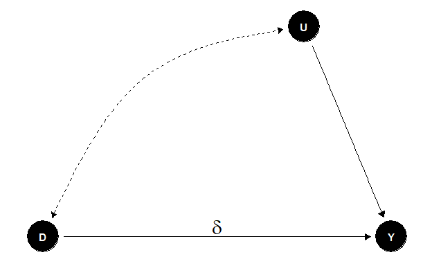
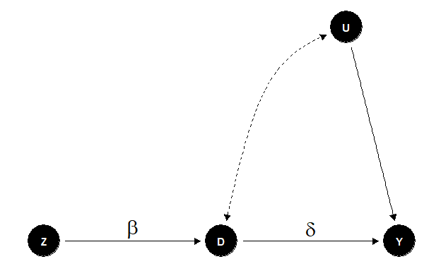
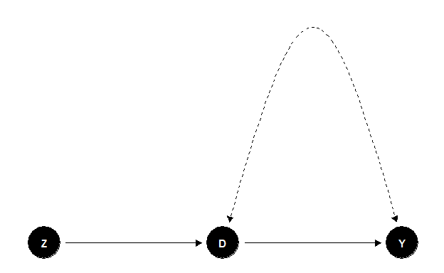
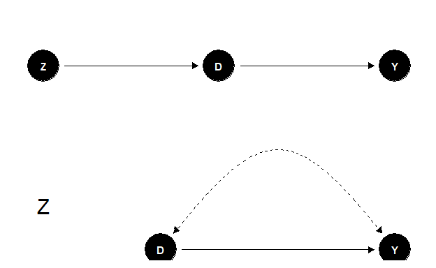
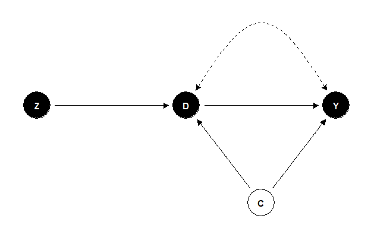

4\. Instrumental Variables
================
João Pedro S. Macalós
10/19/2020

# Schedule

<table class="table" style="margin-left: auto; margin-right: auto;">

<thead>

<tr>

<th style="text-align:left;">

N

</th>

<th style="text-align:left;">

Session

</th>

<th style="text-align:left;">

Reading

</th>

<th style="text-align:left;">

Date

</th>

</tr>

</thead>

<tbody>

<tr>

<td style="text-align:left;">

1

</td>

<td style="text-align:left;">

DAGs and the Structural Causal Model

</td>

<td style="text-align:left;">

Ch. 4

</td>

<td style="text-align:left;">

09/22/2020

</td>

</tr>

<tr>

<td style="text-align:left;">

2

</td>

<td style="text-align:left;">

Potential Outcomes: Introduction

</td>

<td style="text-align:left;">

Ch. 5

</td>

<td style="text-align:left;">

09/29/2020

</td>

</tr>

<tr>

<td style="text-align:left;">

3

</td>

<td style="text-align:left;">

Matching and subclassification

</td>

<td style="text-align:left;">

Ch. 6

</td>

<td style="text-align:left;">

10/06/2020

</td>

</tr>

<tr>

<td style="text-align:left;font-weight: bold;color: white !important;background-color: red !important;">

–

</td>

<td style="text-align:left;font-weight: bold;color: white !important;background-color: red !important;">

BREAK

</td>

<td style="text-align:left;font-weight: bold;color: white !important;background-color: red !important;">

–

</td>

<td style="text-align:left;font-weight: bold;color: white !important;background-color: red !important;">

10/13/2020

</td>

</tr>

<tr>

<td style="text-align:left;">

4

</td>

<td style="text-align:left;">

Instrumental variables

</td>

<td style="text-align:left;">

Ch. 8

</td>

<td style="text-align:left;">

10/20/2020

</td>

</tr>

<tr>

<td style="text-align:left;font-size: 11px;">

5

</td>

<td style="text-align:left;font-size: 11px;">

Dagifying IVs

</td>

<td style="text-align:left;font-size: 11px;">

TBD

</td>

<td style="text-align:left;font-size: 11px;">

10/27/2020

</td>

</tr>

<tr>

<td style="text-align:left;">

</td>

<td style="text-align:left;">

<https://ysi.ineteconomics.org/project/5f4258a9689c756fb5ddb637/event/5f85c99ca21037043d1a3afe>

</td>

<td style="text-align:left;">

</td>

<td style="text-align:left;">

</td>

</tr>

<tr>

<td style="text-align:left;">

6

</td>

<td style="text-align:left;">

Regression Discontinuity Designs

</td>

<td style="text-align:left;">

Ch. 7

</td>

<td style="text-align:left;">

12/01/2020

</td>

</tr>

<tr>

<td style="text-align:left;">

–

</td>

<td style="text-align:left;">

BREAK - YSI Plenary

</td>

<td style="text-align:left;">

–

</td>

<td style="text-align:left;">

11/10/2020

</td>

</tr>

<tr>

<td style="text-align:left;">

–

</td>

<td style="text-align:left;">

BREAK - YSI Plenary

</td>

<td style="text-align:left;">

–

</td>

<td style="text-align:left;">

11/17/2020

</td>

</tr>

<tr>

<td style="text-align:left;">

7

</td>

<td style="text-align:left;">

Difference-in-differences

</td>

<td style="text-align:left;">

Ch. 9

</td>

<td style="text-align:left;">

12/08/2020

</td>

</tr>

<tr>

<td style="text-align:left;">

8

</td>

<td style="text-align:left;">

Dagifying DiD

</td>

<td style="text-align:left;">

TBD

</td>

<td style="text-align:left;">

12/15/2020

</td>

</tr>

<tr>

<td style="text-align:left;">

–

</td>

<td style="text-align:left;">

End of year break

</td>

<td style="text-align:left;">

–

</td>

<td style="text-align:left;">

</td>

</tr>

<tr>

<td style="text-align:left;">

–

</td>

<td style="text-align:left;">

End of year break

</td>

<td style="text-align:left;">

–

</td>

<td style="text-align:left;">

</td>

</tr>

<tr>

<td style="text-align:left;">

9

</td>

<td style="text-align:left;">

Front-door criterion: a new research design?

</td>

<td style="text-align:left;">

TBD

</td>

<td style="text-align:left;">

01/05/2021

</td>

</tr>

<tr>

<td style="text-align:left;">

10

</td>

<td style="text-align:left;">

Conclusion

</td>

<td style="text-align:left;">

–

</td>

<td style="text-align:left;">

01/12/2021

</td>

</tr>

</tbody>

</table>

# Instrumental Variables

## References

  - Morgan and Winship ([2014](#ref-morgan_winship2014counterfactuals)
    ch. 9)

  - Cunningham ([2020](#ref-cunningham2020causal) ch. 8)

  - Angrist and Pischke ([2008](#ref-angrist2008mhe) ch. 4)

  - Pearl, Glymour, and Jewell ([2016](#ref-pearl2016causal), 78–87)

## Rationale

Sometimes, it is not possible to identify and estimate the causal effect
of some variable  on
some outcome  because it
is impossible to close open backdoor paths by conditioning or
stratification. Such situations usually arise because there are
unobservable or unmeasurable variables in such backdoor paths.

A possible solution in these cases is to find a source of exogenous
variation that determines  solely through its effect on
. A variable that
represent such source of exogenous variation is called a **instrumental
variable (IV)**.

## DAGs (Structural) tradition

  - Linearity assumed all along

### Crash review on path analysis

> In a linear system, the total effect of
>  on
>  is simply the sum of
> the products of the coefficients of the edges on every nonbackdoor
> path from  to
> . \[…\] To find the
> total effect of  on
> , first find every
> nonbackdoor path from 
> to ; then, for each
> path, multiply the coefficients on the path together; then add up all
> the products. Pearl, Glymour, and Jewell
> ([2016](#ref-pearl2016causal), 82)

Let’s take a look at a concrete example:

<!-- -->

In this example, the total effect of
 on
 is:

  
  

However, to identify this effect in the data, we must control for
 in order to close the
backdoor path . We can see this numerically:

``` r
set.seed(44)
b = rnorm(100)
x = rnorm(100) + b
a = 2*x + rnorm(100)
y = x + a + b + rnorm(100, 0, .01)

# Biased estimated TE:
lm(y ~ x)$coefficients['x']
```

    ##        x 
    ## 3.493401

``` r
# Unbiased estimated TE
lm(y ~ x + b)$coefficients['x']
```

    ##        x 
    ## 2.968442

To find the direct effects of
 on
, we must control for
all undirected paths between these two variables. In the above example,
the true  is equal to
one. Thus, the estimated  is:

``` r
# Unbiased estimated DE:
lm(y ~ x + b + a)$coefficients['x']
```

    ##        x 
    ## 1.004129

### IV setting

In a instrumental variables setting, the problem is that it is
impossible to block the open backdoor path between the variable of
interest. Suppose the following model:

  

\\end{equation}")  

Where  represents all
causes of  other than
, and
 is a
invariant, structural causal effect that applies to all members of the
population of interest. If there is a unobservable variable in
 that simultaneously
causes  and
, the parameter

cannot be estimated by OLS.

This situation can be expressed by the following DAG:

<!-- -->

A alternative in this case is to look for a variable
 that is related to
 only through its effect
on :

<!-- -->

Assuming that our DAG is a true depiction of the data generating
process, we know from our previous analysis of path effects that the
total effect of  on
 is equal to , and that the effect of
 on
 is equal to
.

Hence, we can estimate
 by
dividing the estimated parameter of
 on the first regression
() by the estimated parameter of
 in the second
regression ().

This method of using instrumental variables to identify causal effects
in two stages is usually referred to as the “two stage least squares
method” (2SLS).

  - The regression of 
    on  is the “reduced
    form”

  - The regression of 
    on  is the “first
    stage”

Question: Why it is incorrect to test whether
 is a good instrument by
testing if it is uncorrelated with
 conditional on
?

## Wald estimator

The simplest case to analyze is when the instrument and the treatment
variables are binary. In this case, we can take population-level
expectation of equation (1):

  
![\\begin{align}&#10;E\[Y\] &= E\[\\alpha + \\delta D + U\] \\\\&#10;&=
\\alpha + \\delta E\[D\] +
E\[U\]&#10;\\qquad(2)&#10;\\end{align}](https://latex.codecogs.com/png.latex?%5Cbegin%7Balign%7D%0AE%5BY%5D%20%26%3D%20E%5B%5Calpha%20%2B%20%5Cdelta%20D%20%2B%20U%5D%20%5C%5C%0A%26%3D%20%5Calpha%20%2B%20%5Cdelta%20E%5BD%5D%20%2B%20E%5BU%5D%0A%5Cqquad%282%29%0A%5Cend%7Balign%7D
"\\begin{align}
E[Y] &= E[\\alpha + \\delta D + U] \\\\
&= \\alpha + \\delta E[D] + E[U]
\\qquad(2)
\\end{align}")  

And rewrite it as a difference equation in
:

  
![\\begin{align}&#10;E\[Y|Z=1\] - E\[Y|Z=0\] &= \\\\&#10;&= \\alpha +
\\delta E\[D|Z=1\] + E\[U|Z=1\] - (\\alpha + \\delta E\[D|Z=1\] +
E\[U|Z=1\]) \\\\&#10;&= \\delta (E\[D|Z=1\] - E\[D|Z=0\]) + E\[U|Z=1\] -
E\[U|Z=0\]&#10;\\qquad(3)&#10;\\end{align}](https://latex.codecogs.com/png.latex?%5Cbegin%7Balign%7D%0AE%5BY%7CZ%3D1%5D%20-%20E%5BY%7CZ%3D0%5D%20%26%3D%20%5C%5C%0A%26%3D%20%5Calpha%20%2B%20%5Cdelta%20E%5BD%7CZ%3D1%5D%20%2B%20E%5BU%7CZ%3D1%5D%20-%20%28%5Calpha%20%2B%20%5Cdelta%20E%5BD%7CZ%3D1%5D%20%2B%20E%5BU%7CZ%3D1%5D%29%20%5C%5C%0A%26%3D%20%5Cdelta%20%28E%5BD%7CZ%3D1%5D%20-%20E%5BD%7CZ%3D0%5D%29%20%2B%20E%5BU%7CZ%3D1%5D%20-%20E%5BU%7CZ%3D0%5D%0A%5Cqquad%283%29%0A%5Cend%7Balign%7D
"\\begin{align}
E[Y|Z=1] - E[Y|Z=0] &= \\\\
&= \\alpha + \\delta E[D|Z=1] + E[U|Z=1] - (\\alpha + \\delta E[D|Z=1] + E[U|Z=1]) \\\\
&= \\delta (E[D|Z=1] - E[D|Z=0]) + E[U|Z=1] - E[U|Z=0]
\\qquad(3)
\\end{align}")  

Now, if we divide both side of (3) by ![E\[D|Z=1\] -
E\[D|Z=0\]](https://latex.codecogs.com/png.latex?E%5BD%7CZ%3D1%5D%20-%20E%5BD%7CZ%3D0%5D
"E[D|Z=1] - E[D|Z=0]"),

  
![\\begin{align}&#10;\\frac{E\[Y|Z=1\] - E\[Y|Z=0\]}{E\[D|Z=1\] -
E\[D|Z=0\]} &= \\frac{\\delta (E\[D|Z=1\] - E\[D|Z=0\]) + E\[U|Z=1\] -
E\[U|Z=0\]}{E\[D|Z=1\] - E\[D|Z=0\]} \\\\&#10;&= \\delta +
\\frac{E\[U|Z=1\] - E\[U|Z=0\]}{E\[D|Z=1\] -
E\[D|Z=0\]}&#10;\\qquad(4)&#10;\\end{align}](https://latex.codecogs.com/png.latex?%5Cbegin%7Balign%7D%0A%5Cfrac%7BE%5BY%7CZ%3D1%5D%20-%20E%5BY%7CZ%3D0%5D%7D%7BE%5BD%7CZ%3D1%5D%20-%20E%5BD%7CZ%3D0%5D%7D%20%26%3D%20%5Cfrac%7B%5Cdelta%20%28E%5BD%7CZ%3D1%5D%20-%20E%5BD%7CZ%3D0%5D%29%20%2B%20E%5BU%7CZ%3D1%5D%20-%20E%5BU%7CZ%3D0%5D%7D%7BE%5BD%7CZ%3D1%5D%20-%20E%5BD%7CZ%3D0%5D%7D%20%5C%5C%0A%26%3D%20%5Cdelta%20%2B%20%5Cfrac%7BE%5BU%7CZ%3D1%5D%20-%20E%5BU%7CZ%3D0%5D%7D%7BE%5BD%7CZ%3D1%5D%20-%20E%5BD%7CZ%3D0%5D%7D%0A%5Cqquad%284%29%0A%5Cend%7Balign%7D
"\\begin{align}
\\frac{E[Y|Z=1] - E[Y|Z=0]}{E[D|Z=1] - E[D|Z=0]} &= \\frac{\\delta (E[D|Z=1] - E[D|Z=0]) + E[U|Z=1] - E[U|Z=0]}{E[D|Z=1] - E[D|Z=0]} \\\\
&= \\delta + \\frac{E[U|Z=1] - E[U|Z=0]}{E[D|Z=1] - E[D|Z=0]}
\\qquad(4)
\\end{align}")  

If our assumption that 
is independent of  is
correct, the second item in the right-hand side of equation (4) is equal
to zero (this second item is the bias of the IV estimator when the
independency assumption is violated). Hence, equation (4) simplifies to:

  
![\\begin{align}&#10;\\frac{E\[Y|Z=1\] - E\[Y|Z=0\]}{E\[D|Z=1\] -
E\[D|Z=0\]} &=
\\delta&#10;\\qquad(5)&#10;\\end{align}](https://latex.codecogs.com/png.latex?%5Cbegin%7Balign%7D%0A%5Cfrac%7BE%5BY%7CZ%3D1%5D%20-%20E%5BY%7CZ%3D0%5D%7D%7BE%5BD%7CZ%3D1%5D%20-%20E%5BD%7CZ%3D0%5D%7D%20%26%3D%20%5Cdelta%0A%5Cqquad%285%29%0A%5Cend%7Balign%7D
"\\begin{align}
\\frac{E[Y|Z=1] - E[Y|Z=0]}{E[D|Z=1] - E[D|Z=0]} &= \\delta
\\qquad(5)
\\end{align}")  

Hence, under these conditions, the ratio of the population-level linear
association between  and
 and between
 and
 is equal to the causal
effect of  on
. This causal effect can
be estimated as:

  
![\\begin{align}&#10;\\hat{\\delta}\_{IV, Wald} =
\\frac{E\_N\[y\_i|z\_i=1\] - E\_N\[y\_i|z\_i=0\]}{E\_N\[d\_i|z\_i=1\] -
E\_N\[d\_i|z\_i=0\]}&#10;\\qquad(6)&#10;\\end{align}](https://latex.codecogs.com/png.latex?%5Cbegin%7Balign%7D%0A%5Chat%7B%5Cdelta%7D_%7BIV%2C%20Wald%7D%20%3D%20%5Cfrac%7BE_N%5By_i%7Cz_i%3D1%5D%20-%20E_N%5By_i%7Cz_i%3D0%5D%7D%7BE_N%5Bd_i%7Cz_i%3D1%5D%20-%20E_N%5Bd_i%7Cz_i%3D0%5D%7D%0A%5Cqquad%286%29%0A%5Cend%7Balign%7D
"\\begin{align}
\\hat{\\delta}_{IV, Wald} = \\frac{E_N[y_i|z_i=1] - E_N[y_i|z_i=0]}{E_N[d_i|z_i=1] - E_N[d_i|z_i=0]}
\\qquad(6)
\\end{align}")  

### Wald estimator: numerical example

Suppose that we’re interested in estimating whether private high schools
outperform public high schools in a given area.

The problem is that we suspect that children that go to private schools
tend to have better educated parents and therefore are more likely to
score better in standardized tests (our measure of performance)
regardless of being in private or public high schools. We also assume
that we have no data on parents education.

Suppose also that the state introduced a voucher program one year
earlier. This voucher was randomly assigned to a subset of all the
families and gave a monetary incentive for the families if they enrolled
their children in a private high school.

<!-- -->

I generated a dataset based on this DAG. Let’s take a look at it:

    ## # A tibble: 10,000 x 3
    ##        d     z     y
    ##    <dbl> <dbl> <dbl>
    ##  1     0     0  51.7
    ##  2     0     0  50.1
    ##  3     0     0  45.3
    ##  4     0     0  49.1
    ##  5     0     0  52.6
    ##  6     0     0  50.1
    ##  7     0     0  46.3
    ##  8     0     0  47.8
    ##  9     0     0  47.9
    ## 10     0     0  47.1
    ## # ... with 9,990 more rows

The following table shows the distribution of voucher winners in our
population:

<!--html_preserve-->

<style>html {
  font-family: -apple-system, BlinkMacSystemFont, 'Segoe UI', Roboto, Oxygen, Ubuntu, Cantarell, 'Helvetica Neue', 'Fira Sans', 'Droid Sans', Arial, sans-serif;
}

#nlboddoznn .gt_table {
  display: table;
  border-collapse: collapse;
  margin-left: auto;
  margin-right: auto;
  color: #333333;
  font-size: 16px;
  background-color: #FFFFFF;
  width: auto;
  border-top-style: solid;
  border-top-width: 2px;
  border-top-color: #A8A8A8;
  border-right-style: none;
  border-right-width: 2px;
  border-right-color: #D3D3D3;
  border-bottom-style: solid;
  border-bottom-width: 2px;
  border-bottom-color: #A8A8A8;
  border-left-style: none;
  border-left-width: 2px;
  border-left-color: #D3D3D3;
}

#nlboddoznn .gt_heading {
  background-color: #FFFFFF;
  text-align: center;
  border-bottom-color: #FFFFFF;
  border-left-style: none;
  border-left-width: 1px;
  border-left-color: #D3D3D3;
  border-right-style: none;
  border-right-width: 1px;
  border-right-color: #D3D3D3;
}

#nlboddoznn .gt_title {
  color: #333333;
  font-size: 125%;
  font-weight: initial;
  padding-top: 4px;
  padding-bottom: 4px;
  border-bottom-color: #FFFFFF;
  border-bottom-width: 0;
}

#nlboddoznn .gt_subtitle {
  color: #333333;
  font-size: 85%;
  font-weight: initial;
  padding-top: 0;
  padding-bottom: 4px;
  border-top-color: #FFFFFF;
  border-top-width: 0;
}

#nlboddoznn .gt_bottom_border {
  border-bottom-style: solid;
  border-bottom-width: 2px;
  border-bottom-color: #D3D3D3;
}

#nlboddoznn .gt_col_headings {
  border-top-style: solid;
  border-top-width: 2px;
  border-top-color: #D3D3D3;
  border-bottom-style: solid;
  border-bottom-width: 2px;
  border-bottom-color: #D3D3D3;
  border-left-style: none;
  border-left-width: 1px;
  border-left-color: #D3D3D3;
  border-right-style: none;
  border-right-width: 1px;
  border-right-color: #D3D3D3;
}

#nlboddoznn .gt_col_heading {
  color: #333333;
  background-color: #FFFFFF;
  font-size: 100%;
  font-weight: normal;
  text-transform: inherit;
  border-left-style: none;
  border-left-width: 1px;
  border-left-color: #D3D3D3;
  border-right-style: none;
  border-right-width: 1px;
  border-right-color: #D3D3D3;
  vertical-align: bottom;
  padding-top: 5px;
  padding-bottom: 6px;
  padding-left: 5px;
  padding-right: 5px;
  overflow-x: hidden;
}

#nlboddoznn .gt_column_spanner_outer {
  color: #333333;
  background-color: #FFFFFF;
  font-size: 100%;
  font-weight: normal;
  text-transform: inherit;
  padding-top: 0;
  padding-bottom: 0;
  padding-left: 4px;
  padding-right: 4px;
}

#nlboddoznn .gt_column_spanner_outer:first-child {
  padding-left: 0;
}

#nlboddoznn .gt_column_spanner_outer:last-child {
  padding-right: 0;
}

#nlboddoznn .gt_column_spanner {
  border-bottom-style: solid;
  border-bottom-width: 2px;
  border-bottom-color: #D3D3D3;
  vertical-align: bottom;
  padding-top: 5px;
  padding-bottom: 6px;
  overflow-x: hidden;
  display: inline-block;
  width: 100%;
}

#nlboddoznn .gt_group_heading {
  padding: 8px;
  color: #333333;
  background-color: #FFFFFF;
  font-size: 100%;
  font-weight: initial;
  text-transform: inherit;
  border-top-style: solid;
  border-top-width: 2px;
  border-top-color: #D3D3D3;
  border-bottom-style: solid;
  border-bottom-width: 2px;
  border-bottom-color: #D3D3D3;
  border-left-style: none;
  border-left-width: 1px;
  border-left-color: #D3D3D3;
  border-right-style: none;
  border-right-width: 1px;
  border-right-color: #D3D3D3;
  vertical-align: middle;
}

#nlboddoznn .gt_empty_group_heading {
  padding: 0.5px;
  color: #333333;
  background-color: #FFFFFF;
  font-size: 100%;
  font-weight: initial;
  border-top-style: solid;
  border-top-width: 2px;
  border-top-color: #D3D3D3;
  border-bottom-style: solid;
  border-bottom-width: 2px;
  border-bottom-color: #D3D3D3;
  vertical-align: middle;
}

#nlboddoznn .gt_striped {
  background-color: rgba(128, 128, 128, 0.05);
}

#nlboddoznn .gt_from_md > :first-child {
  margin-top: 0;
}

#nlboddoznn .gt_from_md > :last-child {
  margin-bottom: 0;
}

#nlboddoznn .gt_row {
  padding-top: 8px;
  padding-bottom: 8px;
  padding-left: 5px;
  padding-right: 5px;
  margin: 10px;
  border-top-style: solid;
  border-top-width: 1px;
  border-top-color: #D3D3D3;
  border-left-style: none;
  border-left-width: 1px;
  border-left-color: #D3D3D3;
  border-right-style: none;
  border-right-width: 1px;
  border-right-color: #D3D3D3;
  vertical-align: middle;
  overflow-x: hidden;
}

#nlboddoznn .gt_stub {
  color: #333333;
  background-color: #FFFFFF;
  font-size: 100%;
  font-weight: initial;
  text-transform: inherit;
  border-right-style: solid;
  border-right-width: 2px;
  border-right-color: #D3D3D3;
  padding-left: 12px;
}

#nlboddoznn .gt_summary_row {
  color: #333333;
  background-color: #FFFFFF;
  text-transform: inherit;
  padding-top: 8px;
  padding-bottom: 8px;
  padding-left: 5px;
  padding-right: 5px;
}

#nlboddoznn .gt_first_summary_row {
  padding-top: 8px;
  padding-bottom: 8px;
  padding-left: 5px;
  padding-right: 5px;
  border-top-style: solid;
  border-top-width: 2px;
  border-top-color: #D3D3D3;
}

#nlboddoznn .gt_grand_summary_row {
  color: #333333;
  background-color: #FFFFFF;
  text-transform: inherit;
  padding-top: 8px;
  padding-bottom: 8px;
  padding-left: 5px;
  padding-right: 5px;
}

#nlboddoznn .gt_first_grand_summary_row {
  padding-top: 8px;
  padding-bottom: 8px;
  padding-left: 5px;
  padding-right: 5px;
  border-top-style: double;
  border-top-width: 6px;
  border-top-color: #D3D3D3;
}

#nlboddoznn .gt_table_body {
  border-top-style: solid;
  border-top-width: 2px;
  border-top-color: #D3D3D3;
  border-bottom-style: solid;
  border-bottom-width: 2px;
  border-bottom-color: #D3D3D3;
}

#nlboddoznn .gt_footnotes {
  color: #333333;
  background-color: #FFFFFF;
  border-bottom-style: none;
  border-bottom-width: 2px;
  border-bottom-color: #D3D3D3;
  border-left-style: none;
  border-left-width: 2px;
  border-left-color: #D3D3D3;
  border-right-style: none;
  border-right-width: 2px;
  border-right-color: #D3D3D3;
}

#nlboddoznn .gt_footnote {
  margin: 0px;
  font-size: 90%;
  padding: 4px;
}

#nlboddoznn .gt_sourcenotes {
  color: #333333;
  background-color: #FFFFFF;
  border-bottom-style: none;
  border-bottom-width: 2px;
  border-bottom-color: #D3D3D3;
  border-left-style: none;
  border-left-width: 2px;
  border-left-color: #D3D3D3;
  border-right-style: none;
  border-right-width: 2px;
  border-right-color: #D3D3D3;
}

#nlboddoznn .gt_sourcenote {
  font-size: 90%;
  padding: 4px;
}

#nlboddoznn .gt_left {
  text-align: left;
}

#nlboddoznn .gt_center {
  text-align: center;
}

#nlboddoznn .gt_right {
  text-align: right;
  font-variant-numeric: tabular-nums;
}

#nlboddoznn .gt_font_normal {
  font-weight: normal;
}

#nlboddoznn .gt_font_bold {
  font-weight: bold;
}

#nlboddoznn .gt_font_italic {
  font-style: italic;
}

#nlboddoznn .gt_super {
  font-size: 65%;
}

#nlboddoznn .gt_footnote_marks {
  font-style: italic;
  font-size: 65%;
}
</style>

<div id="nlboddoznn" style="overflow-x:auto;overflow-y:auto;width:auto;height:auto;">

<table class="gt_table">

<thead class="gt_header">

<tr>

<th colspan="3" class="gt_heading gt_title gt_font_normal" style>

Distribution of voucher winners by school sector

</th>

</tr>

<tr>

<th colspan="3" class="gt_heading gt_subtitle gt_font_normal gt_bottom_border" style>

</th>

</tr>

</thead>

<thead class="gt_col_headings">

<tr>

<th class="gt_col_heading gt_columns_bottom_border gt_left" rowspan="1" colspan="1">

</th>

<th class="gt_col_heading gt_columns_bottom_border gt_center" rowspan="1" colspan="1">

  
  

</th>

<th class="gt_col_heading gt_columns_bottom_border gt_center" rowspan="1" colspan="1">

  
  

</th>

</tr>

</thead>

<tbody class="gt_table_body">

<tr>

<td class="gt_row gt_left">

  
  

</td>

<td class="gt_row gt_center">

8000

</td>

<td class="gt_row gt_center">

1000

</td>

</tr>

<tr>

<td class="gt_row gt_left">

  
  

</td>

<td class="gt_row gt_center">

800

</td>

<td class="gt_row gt_center">

200

</td>

</tr>

</tbody>

</table>

</div>

<!--/html_preserve-->

A naive estimation of the ATE in this example would lead to the
following estimate:

``` r
# Naive ATE
naive_ate <- mean(iv_wald$y[iv_wald$d == 1]) - mean(iv_wald$y[iv_wald$d == 0])

cat('Naive ATE: ', naive_ate)
```

    ## Naive ATE:  9.666667

And the IV Wald estimator:

``` r
# IV Wald Estimator
reduced_form <- mean(iv_wald$y[iv_wald$z == 1]) - mean(iv_wald$y[iv_wald$z == 0])
first_stage <- mean(iv_wald$d[iv_wald$z == 1]) - mean(iv_wald$d[iv_wald$z == 0])

wald_estimator <- reduced_form / first_stage

cat('IV Wald Estimator: ', wald_estimator)
```

    ## IV Wald Estimator:  5.5

Note how the IV Wald estimator generate the same coefficients as we
would have find using 2SLS:

``` r
# Naive estimator
lm(y ~ d, data = iv_wald)$coefficients['d']
```

    ##        d 
    ## 9.666667

``` r
# You recover the estimator either by dividing the coefficient of Z in the reduced form equation by
# the coefficient of Z in the first stage
reduced <- lm(y ~ z, data = iv_wald)$coefficients['z']
first <- lm(d ~ z, data = iv_wald)$coefficients['z']
reduced/first
```

    ##   z 
    ## 5.5

``` r
# Or by plugging the fit values of d from the first stage regression into the reduced form estimation:
fitted_d <- fitted(lm(d ~ z, data = iv_wald))
lm(y ~ fitted_d, data = iv_wald)$coefficients['fitted_d']
```

    ## fitted_d 
    ##      5.5

``` r
# But the standard errors are not correct! Better to use a IV dedicated package:
# library(ivreg)
# summary(ivreg(y ~ d | z, data = iv_wald))
```

### Pitfalls of traditional IVs analysis

  - Recap: the crucial assumption for IVs to work in this setting is the
    independency assumption. In other words, IVs will only work if
     only affect
     through its effect
    on 

  - This assumption cannot be tested\! Therefore, it needs theoretical
    justification, and it is often hard to sustain. IVs are mainly
    criticized on these grounds.

  - The second crucial assumption for IVs to work is that
     is correlated with
    . If this is not the
    case, or if this correlation is only **weak**, the bias of IVs
    estimators can be substantial.

  - Given the first criticism, natural occurring IVs are becoming more
    and more popular, as it is easier to justify in these cases the “as
    good as random” assumption.

  - Finally, there is the problem of heterogeneity in the data.
    Traditional IVs assume a constant and homogeneous effect of the
    instrument on the treatment variable across all individuals.
    However, this hypothesis is quite often hard to sustain. Let’s
    explore this issue further:

## Instrumental variables estimators in the presence of heterogeneous effects

This work was mainly developed by the authors connected with the
“potential outcomes” literature.

The key innovation here is the introduction of a new treatment effect
parameter: the **“Local Average Treatment Effects” (LATE)**

### IV estimation as LATE estimation

It is useful to recap the **switching equation**

  
 Y^0_i
\\qquad(7)
\\end{align}")  

and the definition of the treatment effects in the potential outcomes
framework:

  
  

A crucial innovation of the potential outcomes framework in the analysis
of IVs is the introduction of **potential treatment**
() for each state  of the instrument .

When  and
 are binary variables,
there are four possible groups of individuals in the population:

<table class="table" style="width: auto !important; margin-left: auto; margin-right: auto;">

<thead>

<tr>

<th style="text-align:left;">

Category

</th>

<th style="text-align:left;">

Definition

</th>

</tr>

</thead>

<tbody>

<tr>

<td style="text-align:left;">

Compliers ")

</td>

<td style="text-align:left;">

 and 

</td>

</tr>

<tr>

<td style="text-align:left;">

Defiers ")

</td>

<td style="text-align:left;">

 and 

</td>

</tr>

<tr>

<td style="text-align:left;">

Always takers ")

</td>

<td style="text-align:left;">

 and 

</td>

</tr>

<tr>

<td style="text-align:left;">

Never takers ")

</td>

<td style="text-align:left;">

 and 

</td>

</tr>

</tbody>

</table>

It is easier to understand with an example. Consider again the private
schooling example that we analyzed before.

  - Students who would only enroll in private school if offered the
    voucher are **compliers**

  - Students who would only enroll in private school if *not* offered
    the voucher are **defiers**

  - Students who would enrol in private school *regardless* of being
    offered the voucher are **always takers**

  - Students who would not enroll in private school *despite* being
    offered the voucher are **never takers**

Similarly to the the observed output in the switching equation ((7)),
the observed treatment indicator
 can be defined as:

  
Z \\\\
&= D^{Z=0} + \\kappa Z
\\qquad(8)
\\end{align}")  

where . Given these definitions and assumptions,
a valid instrument  for
the causal effect of  on
 must satisfy three
assumptions:

<table class="table" style="width: auto !important; margin-left: auto; margin-right: auto;">

<thead>

<tr>

<th style="text-align:left;">

Assumption

</th>

<th style="text-align:left;">

Definition

</th>

</tr>

</thead>

<tbody>

<tr>

<td style="text-align:left;">

Independence

</td>

<td style="text-align:left;">

 \\perp\\!\\!\\!\\perp Z")

</td>

</tr>

<tr>

<td style="text-align:left;">

Nonzero effect of instrument

</td>

<td style="text-align:left;">

 for all 

</td>

</tr>

<tr>

<td style="text-align:left;">

Monotonicity

</td>

<td style="text-align:left;">

either  for all  or  for all 

</td>

</tr>

</tbody>

</table>

  - Independence assumption:

Similar to the independence assumption  = 0") outlined before:

  - Nonzero effect of instrument:

The instrument must predict treatment assignment for at least some
individuals. Therefore, there must be at least some *compliers* or some
*defiers* in the population.

  - Monotonicity:

The effect of  on
 must be either positive
or zero or negative or zero for all individuals. Therefore, there may be
either compliers or defiers in the population but not both.

If these assumptions hold, then the instrument
 identifies the LATE:
the average treatment effect for the subset of the population whose
treatment selection is induced by the treatment.

If  for all , then the Wald estimator from (6) converges to a particular LATE:

  
![\\begin{equation}&#10;\\hat{\\delta}\_{IV, Wald} \\xrightarrow{p}
E\[\\delta|C=c\]&#10;\\end{equation}](https://latex.codecogs.com/png.latex?%5Cbegin%7Bequation%7D%0A%5Chat%7B%5Cdelta%7D_%7BIV%2C%20Wald%7D%20%5Cxrightarrow%7Bp%7D%20E%5B%5Cdelta%7CC%3Dc%5D%0A%5Cend%7Bequation%7D
"\\begin{equation}
\\hat{\\delta}_{IV, Wald} \\xrightarrow{p} E[\\delta|C=c]
\\end{equation}")  

Which is equal to

  
![\\begin{equation}&#10;E\[Y^1-Y^0|D^{Z=1} = 1, D^{Z=0}
= 0\]&#10;\\qquad(9)&#10;\\end{equation}](https://latex.codecogs.com/png.latex?%5Cbegin%7Bequation%7D%0AE%5BY%5E1-Y%5E0%7CD%5E%7BZ%3D1%7D%20%3D%201%2C%20D%5E%7BZ%3D0%7D%20%3D%200%5D%0A%5Cqquad%289%29%0A%5Cend%7Bequation%7D
"\\begin{equation}
E[Y^1-Y^0|D^{Z=1} = 1, D^{Z=0} = 0]
\\qquad(9)
\\end{equation}")  

### Private schooling example in a LATE context

Let’s reconsider the private schooling example in the context of
heterogeneous treatment effects. As before, we assume that the
independence and nonzero assumptions hold. We also assume that no
parents rebel against the vouchers, i.e., the monotonicity assumption
also holds.

In this situation, it is possible to estimate the proportion of always
takers and never takers from the data.

Always takers can be estimated as the proportion of students on private
schools among the subset of students that were not awarded the voucher,

  
![\\begin{align}&#10;\\frac{Pr\_N\[d\_i = 1, z\_i = 0\]}{Pr\_N\[z\_i
= 0\]} \\xrightarrow{p}
Pr\[C=a\]&#10;\\qquad(10)&#10;\\end{align}](https://latex.codecogs.com/png.latex?%5Cbegin%7Balign%7D%0A%5Cfrac%7BPr_N%5Bd_i%20%3D%201%2C%20z_i%20%3D%200%5D%7D%7BPr_N%5Bz_i%20%3D%200%5D%7D%20%5Cxrightarrow%7Bp%7D%20Pr%5BC%3Da%5D%0A%5Cqquad%2810%29%0A%5Cend%7Balign%7D
"\\begin{align}
\\frac{Pr_N[d_i = 1, z_i = 0]}{Pr_N[z_i = 0]} \\xrightarrow{p} Pr[C=a]
\\qquad(10)
\\end{align}")  

Similarly, never takers can be estimated as the proportion of students
on public schools among those who were awarded the voucher,

  
![\\begin{align}&#10;\\frac{Pr\_N\[d\_i = 0, z\_i = 1\]}{Pr\_N\[z\_i
= 1\]} \\xrightarrow{p}
Pr\[C=n\]&#10;\\qquad(11)&#10;\\end{align}](https://latex.codecogs.com/png.latex?%5Cbegin%7Balign%7D%0A%5Cfrac%7BPr_N%5Bd_i%20%3D%200%2C%20z_i%20%3D%201%5D%7D%7BPr_N%5Bz_i%20%3D%201%5D%7D%20%5Cxrightarrow%7Bp%7D%20Pr%5BC%3Dn%5D%0A%5Cqquad%2811%29%0A%5Cend%7Balign%7D
"\\begin{align}
\\frac{Pr_N[d_i = 0, z_i = 1]}{Pr_N[z_i = 1]} \\xrightarrow{p} Pr[C=n]
\\qquad(11)
\\end{align}")  

Since we assume that there is no defiers in the population,

  
![\\begin{align}&#10;1 - \\frac{Pr\_N\[d\_i = 1, z\_i = 0\]}{Pr\_N\[z\_i
= 0\]} - \\frac{Pr\_N\[d\_i = 0, z\_i = 1\]}{Pr\_N\[z\_i = 1\]}
\\xrightarrow{p}
Pr\[C=c\]&#10;\\qquad(12)&#10;\\end{align}](https://latex.codecogs.com/png.latex?%5Cbegin%7Balign%7D%0A1%20-%20%5Cfrac%7BPr_N%5Bd_i%20%3D%201%2C%20z_i%20%3D%200%5D%7D%7BPr_N%5Bz_i%20%3D%200%5D%7D%20-%20%5Cfrac%7BPr_N%5Bd_i%20%3D%200%2C%20z_i%20%3D%201%5D%7D%7BPr_N%5Bz_i%20%3D%201%5D%7D%20%5Cxrightarrow%7Bp%7D%20Pr%5BC%3Dc%5D%0A%5Cqquad%2812%29%0A%5Cend%7Balign%7D
"\\begin{align}
1 - \\frac{Pr_N[d_i = 1, z_i = 0]}{Pr_N[z_i = 0]} - \\frac{Pr_N[d_i = 0, z_i = 1]}{Pr_N[z_i = 1]} \\xrightarrow{p} Pr[C=c]
\\qquad(12)
\\end{align}")  

Let’s estimate these numbers in the data:

``` r
pr_a <- mean(iv_wald$d[iv_wald$z == 0])
pr_a
```

    ## [1] 0.1111111

``` r
pr_n <- 1 - mean(iv_wald$d[iv_wald$z == 1])
pr_n
```

    ## [1] 0.8

``` r
pr_c <- 1 - pr_a - pr_n
pr_c
```

    ## [1] 0.08888889

To calculate the LATE (average treatment effects for compliers), we need
to:

  
![\\begin{align}&#10;LATE &= E\[\\delta|C=c\] \\\\&#10;&= E\[Y^1|C=c\] -
E\[Y^0|C=c\]&#10;\\qquad(13)&#10;\\end{align}](https://latex.codecogs.com/png.latex?%5Cbegin%7Balign%7D%0ALATE%20%26%3D%20E%5B%5Cdelta%7CC%3Dc%5D%20%5C%5C%0A%26%3D%20E%5BY%5E1%7CC%3Dc%5D%20-%20E%5BY%5E0%7CC%3Dc%5D%0A%5Cqquad%2813%29%0A%5Cend%7Balign%7D
"\\begin{align}
LATE &= E[\\delta|C=c] \\\\
&= E[Y^1|C=c] - E[Y^0|C=c]
\\qquad(13)
\\end{align}")  

We can use the estimated proportions of always takers and never takers
to estimate these potential outcomes from observed data, according to
the following equations:

  
![\\begin{align}&#10;E\[Y|D=1, Z=1\] &= \\frac{Pr\[C=c\]}{Pr\[C=c\] +
Pr\[C=a\]} E\[Y^1|C=c\] \\\\&#10;&+ \\frac{Pr\[C=a\]}{Pr\[C=c\] +
Pr\[C=a\]}
E\[Y^1|C=a\]&#10;\\qquad(14)&#10;\\end{align}](https://latex.codecogs.com/png.latex?%5Cbegin%7Balign%7D%0AE%5BY%7CD%3D1%2C%20Z%3D1%5D%20%26%3D%20%5Cfrac%7BPr%5BC%3Dc%5D%7D%7BPr%5BC%3Dc%5D%20%2B%20Pr%5BC%3Da%5D%7D%20E%5BY%5E1%7CC%3Dc%5D%20%5C%5C%0A%26%2B%20%5Cfrac%7BPr%5BC%3Da%5D%7D%7BPr%5BC%3Dc%5D%20%2B%20Pr%5BC%3Da%5D%7D%20E%5BY%5E1%7CC%3Da%5D%0A%5Cqquad%2814%29%0A%5Cend%7Balign%7D
"\\begin{align}
E[Y|D=1, Z=1] &= \\frac{Pr[C=c]}{Pr[C=c] + Pr[C=a]} E[Y^1|C=c] \\\\
&+ \\frac{Pr[C=a]}{Pr[C=c] + Pr[C=a]} E[Y^1|C=a]
\\qquad(14)
\\end{align}")  

and

  
![\\begin{align}&#10;E\[Y|D=0, Z=0\] &= \\frac{Pr\[C=c\]}{Pr\[C=c\] +
Pr\[C=n\]} E\[Y^0|C=c\] \\\\&#10;&+ \\frac{Pr\[C=n\]}{Pr\[C=c\] +
Pr\[C=n\]}
E\[Y^1|C=n\]&#10;\\qquad(15)&#10;\\end{align}](https://latex.codecogs.com/png.latex?%5Cbegin%7Balign%7D%0AE%5BY%7CD%3D0%2C%20Z%3D0%5D%20%26%3D%20%5Cfrac%7BPr%5BC%3Dc%5D%7D%7BPr%5BC%3Dc%5D%20%2B%20Pr%5BC%3Dn%5D%7D%20E%5BY%5E0%7CC%3Dc%5D%20%5C%5C%0A%26%2B%20%5Cfrac%7BPr%5BC%3Dn%5D%7D%7BPr%5BC%3Dc%5D%20%2B%20Pr%5BC%3Dn%5D%7D%20E%5BY%5E1%7CC%3Dn%5D%0A%5Cqquad%2815%29%0A%5Cend%7Balign%7D
"\\begin{align}
E[Y|D=0, Z=0] &= \\frac{Pr[C=c]}{Pr[C=c] + Pr[C=n]} E[Y^0|C=c] \\\\
&+ \\frac{Pr[C=n]}{Pr[C=c] + Pr[C=n]} E[Y^1|C=n]
\\qquad(15)
\\end{align}")  

Let’s take a moment and think about the distribution of always takers,
never takers, and compliers in our dataset.

<table class="table" style="width: auto !important; margin-left: auto; margin-right: auto;">

<thead>

<tr>

<th style="text-align:left;">

</th>

<th style="text-align:left;">


</th>

<th style="text-align:left;">


</th>

</tr>

</thead>

<tbody>

<tr>

<td style="text-align:left;">


</td>

<td style="text-align:left;">

Never takers or Compliers

</td>

<td style="text-align:left;">

Always takers only

</td>

</tr>

<tr>

<td style="text-align:left;">


</td>

<td style="text-align:left;">

Never takers only

</td>

<td style="text-align:left;">

Always takers or compliers

</td>

</tr>

</tbody>

</table>

In the second and third quadrants, we find only always takers or never
takers. Therefore, we can estimate
![E\[Y^1|C=a\]](https://latex.codecogs.com/png.latex?E%5BY%5E1%7CC%3Da%5D
"E[Y^1|C=a]") and
![E\[Y^0|C=n\]](https://latex.codecogs.com/png.latex?E%5BY%5E0%7CC%3Dn%5D
"E[Y^0|C=n]") from the population:

``` r
ey1_a <- iv_wald %>%
  filter(z == 0, d == 1) %>%
  summarize(y = mean(y)) %>%
  pull(y)

# E[Y1|C=a]
ey1_a
```

    ## [1] 60

``` r
#cat('E[Y1|C=a] = ', ey1_a)

ey0_n <- iv_wald %>%
  filter(z == 1, d == 0) %>%
  summarize(y = mean(y)) %>%
  pull(y)

# E[Y0|C=n]
#cat('E[Y0|N=a] = ', ey0_n)
ey0_n
```

    ## [1] 50

We can also estimate ![E\[Y|D=1,
Z=1\]](https://latex.codecogs.com/png.latex?E%5BY%7CD%3D1%2C%20Z%3D1%5D
"E[Y|D=1, Z=1]") and ![E\[Y|D=0,
Z=0\]](https://latex.codecogs.com/png.latex?E%5BY%7CD%3D0%2C%20Z%3D0%5D
"E[Y|D=0, Z=0]") from the population:

``` r
ey_d1z1 <- iv_wald %>%
  filter(d == 1, z == 1) %>%
  summarize(y = mean(y)) %>%
  pull(y)
#E[Y|D=1, Z=1]
ey_d1z1
```

    ## [1] 58

``` r
ey_d0z0 <- iv_wald %>%
  filter(z == 0, d == 0) %>%
  summarize(y = mean(y)) %>%
  pull(y)
#E[Y|D=0, Z=0]
ey_d0z0
```

    ## [1] 50

Now, the only missing numbers in equations (14) and (15) are the
potential outcomes of interes.

We can calculate them by substituting in these equations:

  
![\\begin{align\*}&#10;E\[Y|D=1, Z=1\] &= \\frac{Pr\[C=c\]}{Pr\[C=c\] +
Pr\[C=a\]} E\[Y^1|C=c\] \\\\&#10;&+ \\frac{Pr\[C=a\]}{Pr\[C=c\] +
Pr\[C=a\]} E\[Y^1|C=a\] \\\\&#10;58 &= \\frac{0.089}{0.089
+ 0.111}E\[Y^1|C=c\] + \\frac{0.111}{0.089 + 0.111}60\\\\&#10;\\dots
\\\\&#10;E\[Y^1|C=c\]&= 55.5&#10;\\end{align\*}](https://latex.codecogs.com/png.latex?%5Cbegin%7Balign%2A%7D%0AE%5BY%7CD%3D1%2C%20Z%3D1%5D%20%26%3D%20%5Cfrac%7BPr%5BC%3Dc%5D%7D%7BPr%5BC%3Dc%5D%20%2B%20Pr%5BC%3Da%5D%7D%20E%5BY%5E1%7CC%3Dc%5D%20%5C%5C%0A%26%2B%20%5Cfrac%7BPr%5BC%3Da%5D%7D%7BPr%5BC%3Dc%5D%20%2B%20Pr%5BC%3Da%5D%7D%20E%5BY%5E1%7CC%3Da%5D%20%5C%5C%0A58%20%26%3D%20%5Cfrac%7B0.089%7D%7B0.089%20%2B%200.111%7DE%5BY%5E1%7CC%3Dc%5D%20%2B%20%5Cfrac%7B0.111%7D%7B0.089%20%2B%200.111%7D60%5C%5C%0A%5Cdots%20%5C%5C%0AE%5BY%5E1%7CC%3Dc%5D%26%3D%2055.5%0A%5Cend%7Balign%2A%7D
"\\begin{align*}
E[Y|D=1, Z=1] &= \\frac{Pr[C=c]}{Pr[C=c] + Pr[C=a]} E[Y^1|C=c] \\\\
&+ \\frac{Pr[C=a]}{Pr[C=c] + Pr[C=a]} E[Y^1|C=a] \\\\
58 &= \\frac{0.089}{0.089 + 0.111}E[Y^1|C=c] + \\frac{0.111}{0.089 + 0.111}60\\\\
\\dots \\\\
E[Y^1|C=c]&= 55.5
\\end{align*}")  

  
![\\begin{align\*}&#10;E\[Y|D=0, Z=0\] &= \\frac{Pr\[C=c\]}{Pr\[C=c\] +
Pr\[C=n\]} E\[Y^0|C=c\] \\\\&#10;&+ \\frac{Pr\[C=n\]}{Pr\[C=c\] +
Pr\[C=n\]} E\[Y^1|C=n\] \\\\&#10;50 &= \\frac{0.089}{0.089 + 0.8}
E\[Y^0|C=c\] + \\frac{0.8}{0.89 + 0.8}50\\\\&#10;\\dots
\\\\&#10;E\[Y^0|C=c\]
= 50&#10;\\end{align\*}](https://latex.codecogs.com/png.latex?%5Cbegin%7Balign%2A%7D%0AE%5BY%7CD%3D0%2C%20Z%3D0%5D%20%26%3D%20%5Cfrac%7BPr%5BC%3Dc%5D%7D%7BPr%5BC%3Dc%5D%20%2B%20Pr%5BC%3Dn%5D%7D%20E%5BY%5E0%7CC%3Dc%5D%20%5C%5C%0A%26%2B%20%5Cfrac%7BPr%5BC%3Dn%5D%7D%7BPr%5BC%3Dc%5D%20%2B%20Pr%5BC%3Dn%5D%7D%20E%5BY%5E1%7CC%3Dn%5D%20%5C%5C%0A50%20%26%3D%20%5Cfrac%7B0.089%7D%7B0.089%20%2B%200.8%7D%20E%5BY%5E0%7CC%3Dc%5D%20%2B%20%5Cfrac%7B0.8%7D%7B0.89%20%2B%200.8%7D50%5C%5C%0A%5Cdots%20%5C%5C%0AE%5BY%5E0%7CC%3Dc%5D%20%3D%2050%0A%5Cend%7Balign%2A%7D
"\\begin{align*}
E[Y|D=0, Z=0] &= \\frac{Pr[C=c]}{Pr[C=c] + Pr[C=n]} E[Y^0|C=c] \\\\
&+ \\frac{Pr[C=n]}{Pr[C=c] + Pr[C=n]} E[Y^1|C=n] \\\\
50 &= \\frac{0.089}{0.089 + 0.8} E[Y^0|C=c] + \\frac{0.8}{0.89 + 0.8}50\\\\
\\dots \\\\
E[Y^0|C=c] = 50
\\end{align*}")  

Hence, the LATE is equal to 5.5.

To keep with the proportions used in this example, our LATE concerns
only a fraction of the total population:

<!-- -->

In this case, even if compliers are not many, they are relevant from a
policy perspective, as we are analyzing the treatment effect of the
policy on those units that respond to the policy.

### Pitfalls of LATE estimations

  - LATE estimators are defined by the instrument under consideration.

  - In most of natural experiments IVs, there is not a clear
    interpretation of who are the compliers in the population. Hence,
    many authors criticize the approach for its black-box character that
    generates difficult to interpret estimates.

If there is more than one instrument available, the LATE estimations
that they will produce will not have the same interpretation.

To conclude the presentation today, let’s go back to DAGs and think how
to DAGify IVs under heterogeneous treatment effects

## DAG representation of heterogeneous effects

Here, I’m presenting the two alternatives proposed by Morgan and Winship
([2014](#ref-morgan_winship2014counterfactuals), 317–22).

Starting from

<!-- -->

They divide in two DAGs:

<!-- -->

The other alternative that he proposes is to include an extra
**compliers** variable in the DAG:

<!-- -->

## Session info:

    ## R version 3.6.3 (2020-02-29)
    ## Platform: x86_64-w64-mingw32/x64 (64-bit)
    ## Running under: Windows 10 x64 (build 19041)
    ## 
    ## Matrix products: default
    ## 
    ## locale:
    ## [1] LC_COLLATE=English_United States.1252 
    ## [2] LC_CTYPE=English_United States.1252   
    ## [3] LC_MONETARY=English_United States.1252
    ## [4] LC_NUMERIC=C                          
    ## [5] LC_TIME=English_United States.1252    
    ## 
    ## attached base packages:
    ## [1] stats     graphics  grDevices utils     datasets  methods   base     
    ## 
    ## other attached packages:
    ##  [1] ggalluvial_0.12.2 gt_0.2.0.5        ggraph_2.0.2      kableExtra_1.1.0 
    ##  [5] knitr_1.28        dagitty_0.2-2     ggdag_0.2.2       ggpubr_0.2.5     
    ##  [9] magrittr_1.5      forcats_0.5.0     stringr_1.4.0     dplyr_1.0.2      
    ## [13] purrr_0.3.4       readr_1.3.1       tidyr_1.1.2       tibble_3.0.3     
    ## [17] ggplot2_3.3.2     tidyverse_1.3.0   bookdown_0.20    
    ## 
    ## loaded via a namespace (and not attached):
    ##  [1] fs_1.4.1           lubridate_1.7.8    webshot_0.5.2      httr_1.4.1        
    ##  [5] tools_3.6.3        backports_1.1.6    utf8_1.1.4         R6_2.4.1          
    ##  [9] DBI_1.1.0          colorspace_1.4-1   withr_2.1.2        tidyselect_1.1.0  
    ## [13] gridExtra_2.3      curl_4.3           compiler_3.6.3     cli_2.0.2         
    ## [17] rvest_0.3.5        Cairo_1.5-11       xml2_1.3.1         labeling_0.3      
    ## [21] sass_0.2.0         scales_1.1.0       checkmate_2.0.0    digest_0.6.25     
    ## [25] rmarkdown_2.3      pkgconfig_2.0.3    htmltools_0.4.0    dbplyr_1.4.2      
    ## [29] highr_0.8          rlang_0.4.7        readxl_1.3.1       rstudioapi_0.11   
    ## [33] farver_2.0.3       generics_0.0.2     jsonlite_1.6.1     Rcpp_1.0.4.6      
    ## [37] munsell_0.5.0      fansi_0.4.1        viridis_0.5.1      lifecycle_0.2.0   
    ## [41] stringi_1.4.3      yaml_2.2.1         MASS_7.3-51.5      grid_3.6.3        
    ## [45] ggrepel_0.8.2      crayon_1.3.4       cowplot_1.0.0      graphlayouts_0.6.0
    ## [49] haven_2.2.0        hms_0.5.3          pillar_1.4.4       igraph_1.2.4.1    
    ## [53] boot_1.3-24        ggsignif_0.6.0     reprex_0.3.0       glue_1.4.0        
    ## [57] evaluate_0.14      V8_3.0.2           modelr_0.1.6       vctrs_0.3.4       
    ## [61] tweenr_1.0.1       cellranger_1.1.0   gtable_0.3.0       polyclip_1.10-0   
    ## [65] assertthat_0.2.1   xfun_0.13          ggforce_0.3.1      broom_0.7.0       
    ## [69] tidygraph_1.1.2    viridisLite_0.3.0  ellipsis_0.3.0

## References

<div id="refs" class="references hanging-indent">

<div id="ref-angrist2008mhe">

Angrist, Joshua D., and Jörn-Steffen Pischke. 2008. *Mostly Harmless
Econometrics: An Empiricist’s Companion*. Princeton University Press.

</div>

<div id="ref-cunningham2020causal">

Cunningham, Scott. 2020. *Causal Inference: The Mixtape (V. 1.8)*.
Manuscript.

</div>

<div id="ref-morgan_winship2014counterfactuals">

Morgan, Stephen L., and Christopher Winship. 2014. *Counterfactuals and
Causal Inference: Methods and Principles for Social Research*. Second.
Analytical Methods for Social Research. Cambridge: Cambridge University
Press.

</div>

<div id="ref-pearl2016causal">

Pearl, J., M. Glymour, and N. P. Jewell. 2016. *Causal Inference in
Statistics: A Primer*. Wiley.

</div>

</div>
